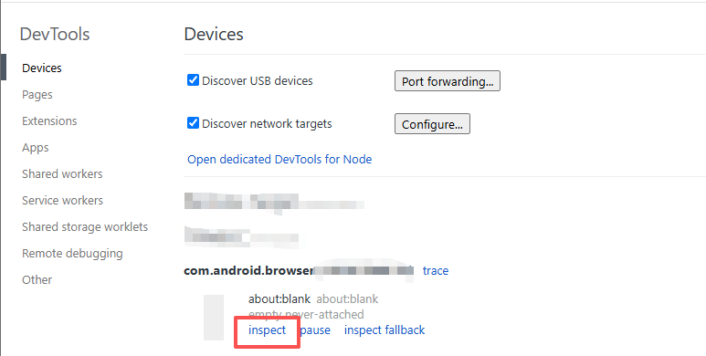

# Android WebView 调试

## 1.开启 WebView 调试

在 Android 代码中添加：

```java
WebView.setWebContentsDebuggingEnabled(true);
```

具体在哪个java文件里添加可以先看 `AndroidManifest.xml`，找到 `<application>` 标签下带有 `exported` 属性的 `<activity>` 标签。

这个标签上 android:name 的值就是 java 文件名。

```xml
<application>
    <activity 
        android:name=".MainActivity"
        android:exported="true"
    >
    </activity>
</application>
```

那么我们就在 `MainActivity` 类的 `onCreate` 方法下添加。

```java
public class MainActivity extends AppCompatActivity {
    @Override
    protected void onCreate(Bundle savedInstanceState) {
        super.onCreate(savedInstanceState);

        if (BuildConfig.DEBUG && Build.VERSION.SDK_INT >= Build.VERSION_CODES.KITKAT) {
            WebView.setWebContentsDebuggingEnabled(true);
        }
    }
}
```

## 2.手机设置

- 开启开发者模式
- 开启 USB 调试
- 连接 USB

## 打开调试页

在 Chrome 浏览器输入：

```
chrome://inspect/#devices
```

正确连接可以看到设备列表

## 点击 inspect

点击 inspect 就可以打开调试页面了。

