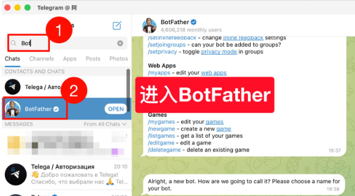
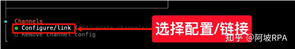
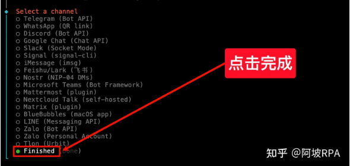
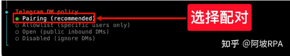
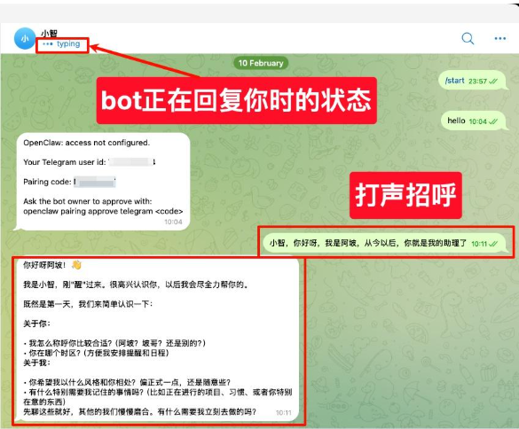

# openclaw 接入 telegram

接入telegram非常简单，最难的一步可能就是要有一个telegram账号。

教程来自 [打通OpenClaw与Telegram的超详细实操教程](https://zhuanlan.zhihu.com/p/2005005876503790436)

配对码部分有修改

## 1.创建bot获取Token

在telegram中搜索 `@BotFather`（注意：必须是这个名字，而且有蓝色认证标识）

选中后点击 `start`，开始聊天



输入 `/newbot`，创建一个新的bot，按照提示设置机器人名称和用户名，完成后会收到一个 **API Token**，请务必保存好，后面配置时需要用到。


搜索刚刚创建的bot的用户名，进入聊天界面，点击Start


现在，虽然已经创建成功，但是它还没办法和你交流

## 2.配置openclaw

在终端输入以下命令

```bash
openclaw config
```

选择 `local`


进入 **channels** 配置项


选择 **配置连接**



选择 **电报（Telegram）**


粘贴刚刚保存的 Bot Token


确认无误后点击完成



进入配对模式，系统会询问安全策略，选择 yes，默认使用配对模式


选择配对（Pairing）



点击继续


## 3.获取配对码

这是回到 Telegram 聊天界面，与bot对话，他会回复一条带有配对码的信息


## 4.完成配对

在终端执行以下命令，将 openclaw 与你的 Bot 绑定：

```bash
openclaw pairing approve telegram 你的配对码
```


## 5.测试

