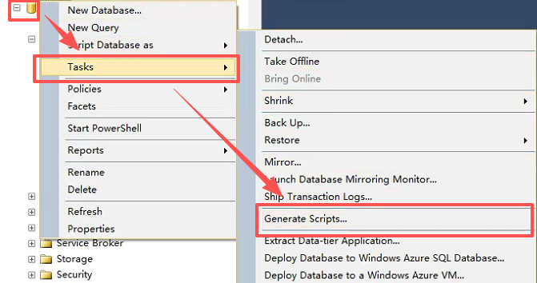
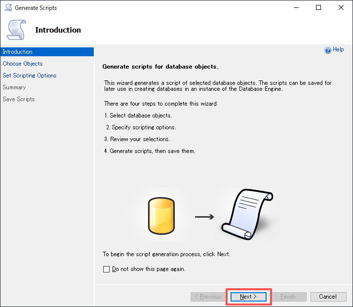
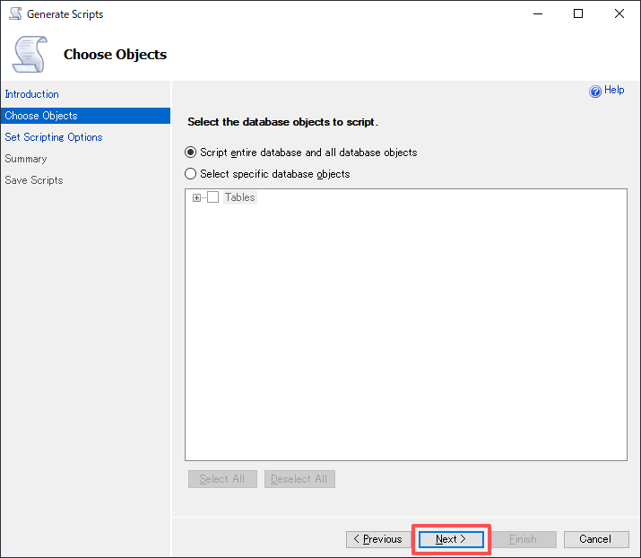
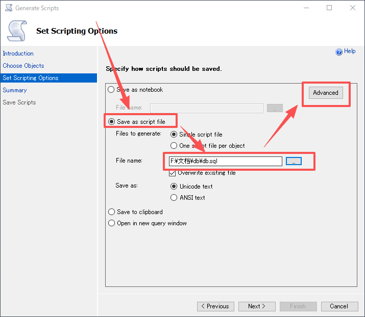
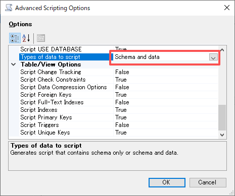
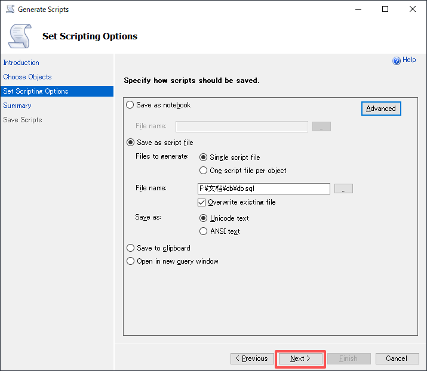
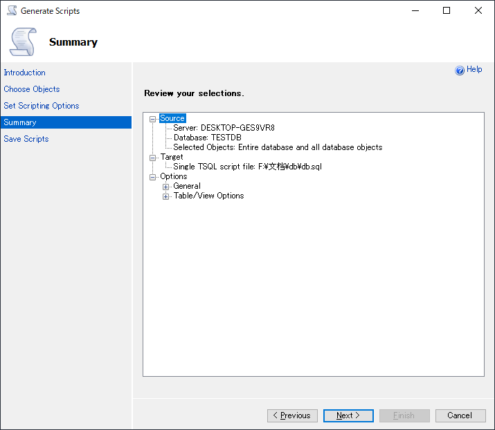
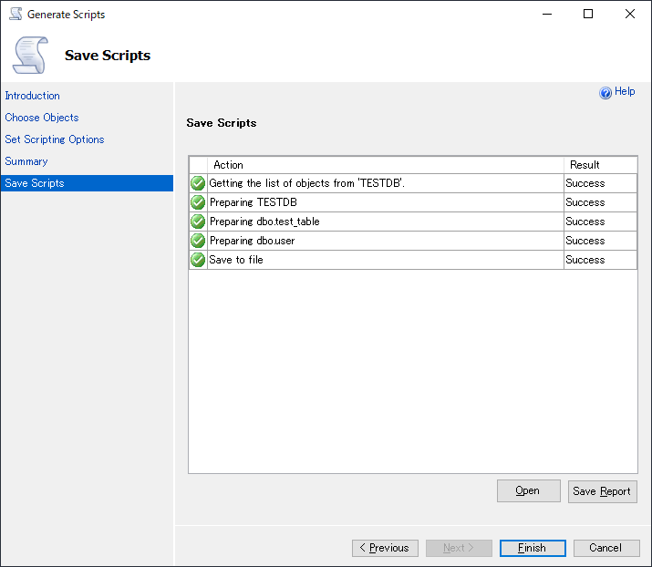

# SqlServer 导出表结构和数据

## 1.在要导出的数据库上右键，选择 任务（Tasks） -> 生成脚本（Generate Scripts...）

## 2.在介绍画面点击下一步（next）

## 3.选择要导出的数据库对象，并点击下一步（next）

这里有两个选项，一个是全部导出，一个是选择导出库中某一个对象，我在这里选择的是全部导出

## 4.选择导出方式、导出地址、选择高级选项

## 5.高级选项

这里在 Types of data to script 选项中，可以选择只导出表结构/只导出表数据/表结构+数据全部导出

## 6.点击下一步（next）

## 7.确认导出进行下一步（next）

## 8.导出完成，可以在之前设置的导出地址中查看导出后的文件

