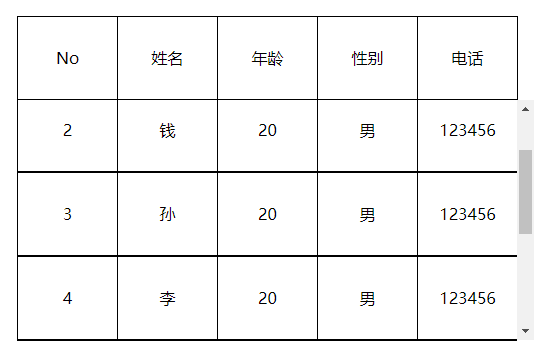

# Html: table如何固定首行

## 效果

固定首行，首行标题信息不会随滚动条滚动而消失。

## 主要使用css

- width：calc(100% + 17px)
  - 设置于 `tbody`，在 table 宽度的基础上加上 17px，17px是滚动条的宽度
- overflow-y：auto
  - 设置在 `tbody` 来显示滚动条
- display：table
  - 设置于 `tr` 配合 `width:100%`，来占满table
- table-layout：fixed
  - 使首行和内容行对齐，使用这个的时候以上三个必须设置才能达到想要的效果

## 朴实无华的效果图：



**Css**

```
<style type="text/css">
		<!-- 清除margin和padding -->
		* {
			margin: 0;
			padding: 0;
		}
 
		table {
			/* 设置表格合并边框 */
			border-collapse: collapse;
			/* 将表格在画面中水平具中 */
			margin: 100px auto;
			/* 设置表格宽度 */
			width: 500px;
			/* 设置表格底部边框 */
			border-bottom: 1px solid black;
		}
 
		tbody {
			/* 设置tbody为行级块元素或块元素 */
			display: inline-block;
			/* 设置显示高度 */
			height: 240px;
			/* 17px为默认滚动条宽度 */
			width: calc(100% + 17px);
			/* 隐藏水平溢出内容 */
			overflow-x: hidden;
			/* 当垂直内容超出显示高度时以滚动条形式展示 */
			overflow-y: auto;
		}
 
		tr {
			/* 将tr设置为table元素,以此达到内容沾满table的效果 */
			display: table;
			/* 将tr宽度设置为100%,以此达到内容沾满table的效果 */
			width: 100%;
			/* 设置table-layout为fixed以达到首行和内容行对其的效果 */
			table-layout: fixed;
		}
 
		td {
			border: 1px solid black;
			height: 80px;
			/* 文字水平垂直居中 */
			text-align: center;
			line-height: 80px;
		}
 
	</style>
```

**Html**

```html
<body>
	<table>
 		<thead>
 			<tr>
 				<td>No</td>
 				<td>姓名</td>
 				<td>年龄</td>
 				<td>性别</td>
 				<td>电话</td>
 			</tr>
 		</thead>
 		<tbody>
 			<tr>
 				<td>1</td>
 				<td>赵</td>
 				<td>20</td>
 				<td>男</td>
 				<td>123456</td>
 			</tr>
 			<tr>
 				<td>2</td>
 				<td>钱</td>
 				<td>20</td>
 				<td>男</td>
 				<td>123456</td>
 			</tr>
 			<tr>
 				<td>3</td>
 				<td>孙</td>
 				<td>20</td>
 				<td>男</td>
 				<td>123456</td>
 			</tr>
 			<tr>
 				<td>4</td>
 				<td>李</td>
 				<td>20</td>
 				<td>男</td>
 				<td>123456</td>
 			</tr>
 			<tr>
 				<td>5</td>
 				<td>周</td>
 				<td>20</td>
 				<td>男</td>
 				<td>123456</td>
 			</tr>
 			<tr>
 				<td>6</td>
 				<td>张三</td>
 				<td>20</td>
 				<td>男</td>
 				<td>123456</td>
 			</tr>
 			<tr>
 				<td>7</td>
 				<td>李四</td>
 				<td>21</td>
 				<td>男</td>
 				<td>654321</td>
 			</tr>
 		</tbody>
 	</table>
</body>
```

