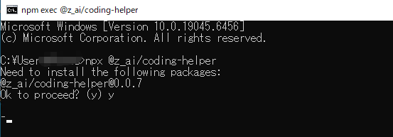
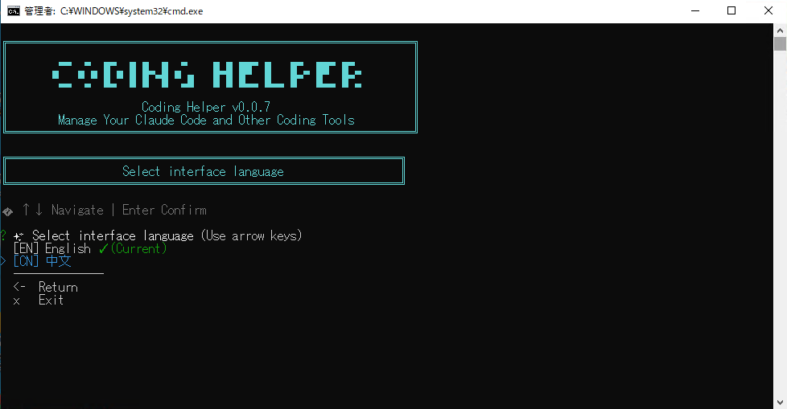
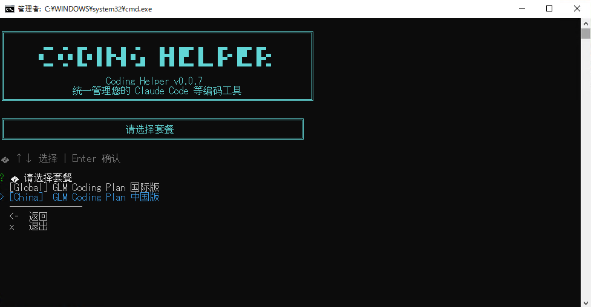
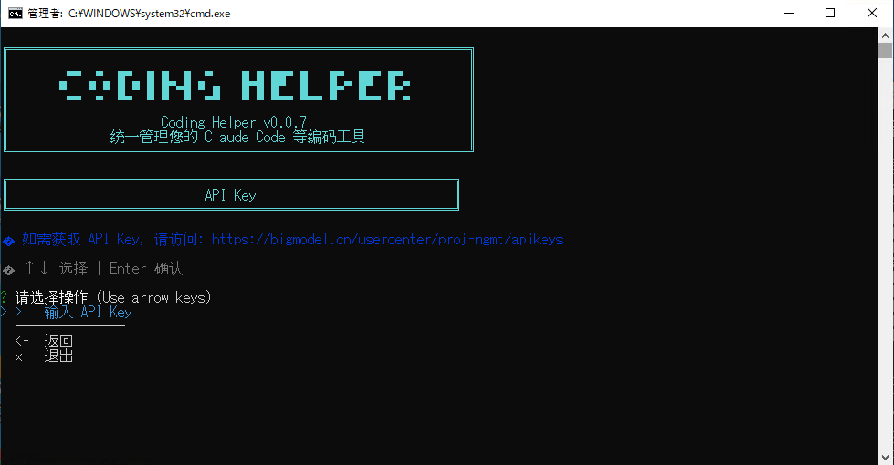
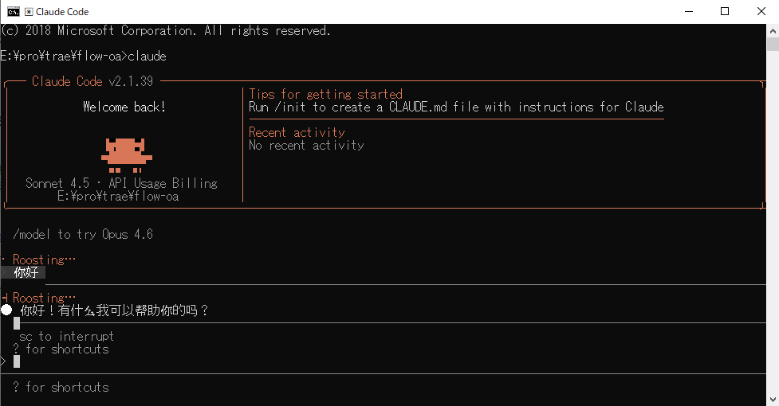

# windows 安装 Claude Code

准备工作

- 一台电脑（Windows10/11）
- Node 环境（18以上）
- Git 环境


## 1.验证环境

确认 Node 和 Git 正常被安装

```bash
node -v
git --version
```

## 2.安装 Claude Code

1. 打开命令行工具（如 PowerShell 或 cmd）。

2. 执行以下命令安装 Claude Code：

```bash
npm install -g @claude-code/claude-code
```

3.成功后验证，如果正常输出版本号代表安装成功

```bash
claude --version
```

## 3.模型使用

Claude Code可以使用官方的 Claude 模型，或其他开源的模型。

Claude模型的好处是能立强，体验好，与Claude Code很适配，但需要科学上网，而且在国内极易封号。

其他开源模型，特别是国产模型价格相对便宜，而且不容易封号。

这里以智谱（GLM）为例

### 获取GLM API Key

访问【https://bigmodel.cn/usercenter/proj-mgmt/apikeys】进行登录/注册，获取API Key

生成的 API Key 要妥善保管不要外泄，API的费用计算全靠这个API Key

### 配置环境变量

GLM已经提供了自动化助手供用户使用

[GLM 自动化助手](https://docs.bigmodel.cn/cn/guide/develop/claude#%E6%96%B9%E5%BC%8F%E4%B8%80%EF%BC%9A%E8%87%AA%E5%8A%A8%E5%8C%96%E5%8A%A9%E6%89%8B)

[coding-helper 文档](https://docs.bigmodel.cn/cn/coding-plan/extension/coding-tool-helper)

打开CMD控制台，输入以下命令

```
npx @z_ai/coding-helper
```

询问是否安装时输入 y



依据喜好选择语言



选择套餐



输入创建好的key



进行配置刷新


到这里配置就完成了

## 4.使用Claude Code

重新打开一个终端，位置可以在桌面或是常用的文件夹中

输入 Claude，这里可能会询问是否同意读写此文件夹下内容，选择Yes即可

```
Claude
```



成功进入CC启动页后，就可以和CC进行交流了

## Claude Code可以做什么？

- 代码生成
- 文件费雷
- 图片格式转换
- 添加/去除水印
- 图片压缩
- 内容分析

它可以帮我们处理各种各样重复性的工作任务。