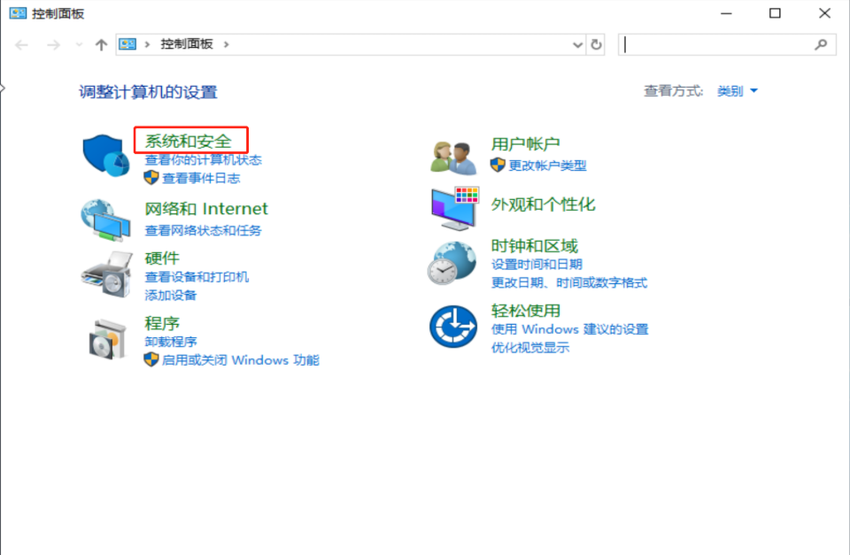
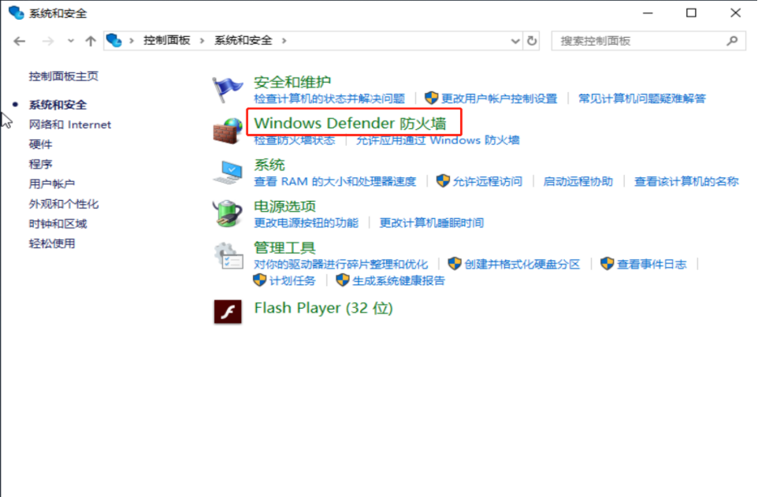
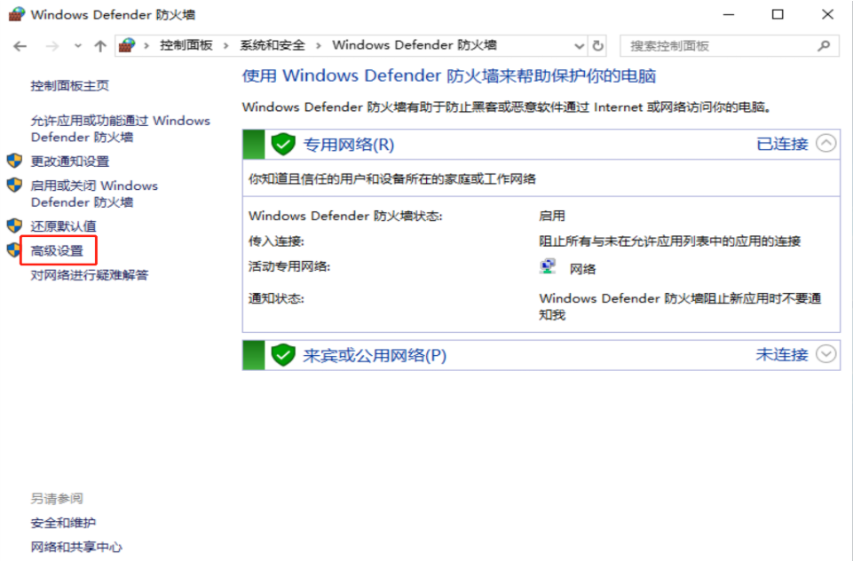
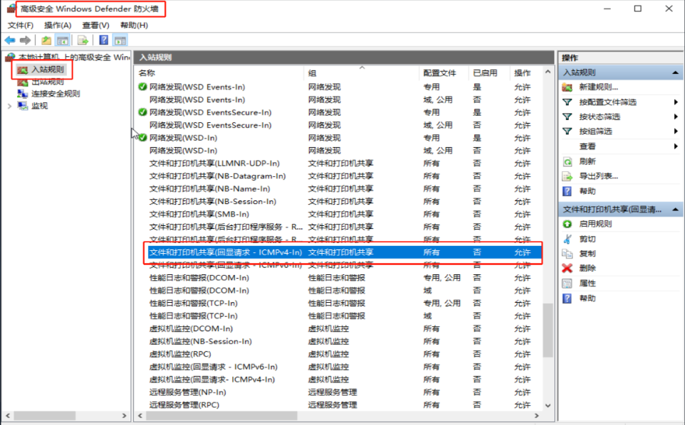
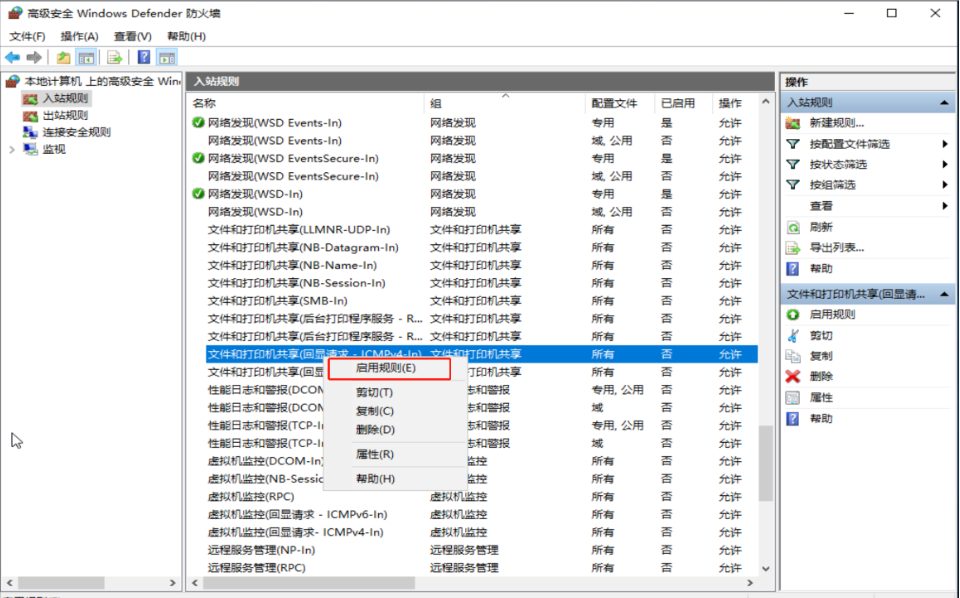
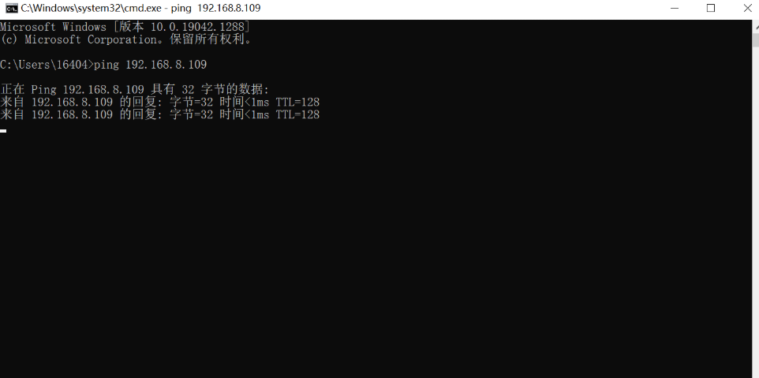

# windows虚拟机与主机互ping问题

在创建虚拟机正常连接网络后，有时会发现无法与主机进行ping操作。

可能是由于 **Windows Defender 防火墙** 导致的。

## 环境

- 主机：windows 10
- 虚拟机：windows 102019

## 问题

虚拟机与主机之间在同网段但无法 ping 通。

## 解决办法

在 `Windows Defender 防火墙 - 高级设置 - 入站规则` 中启用 `文件和打印机共享（回显请求 - ICMPv4-In）`

1.进入 `控制面板 - 系统和安全 - Windows Defender 防火墙 - 高级设置`

2.点击 `入站规则`，找到 `文件和打印机共享（回显请求 - ICMPv4-In）`

3.右键 `启用规则`

4.测试 ping

