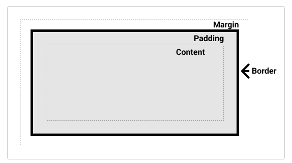
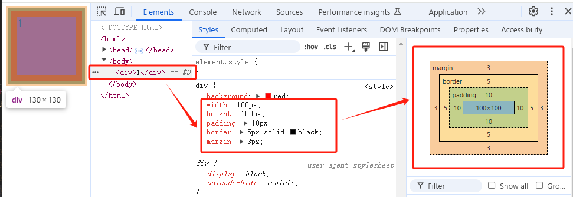
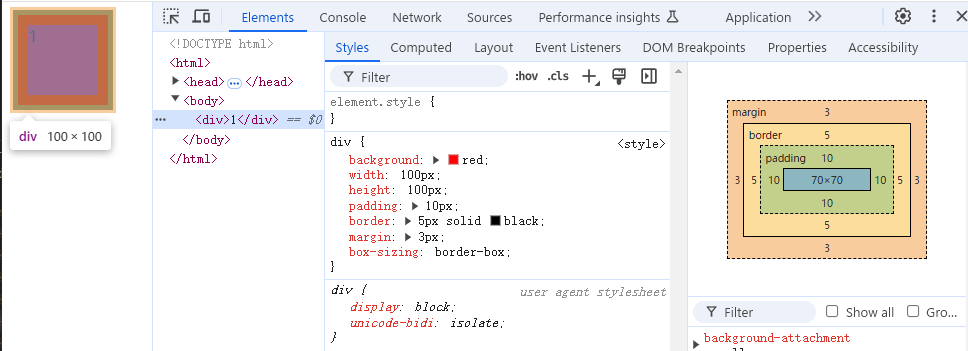

# 盒模型

盒模型是网页布局的基础，也是网页设计中一个重要的方面。盒模型决定了布局是否简洁，而布局的简洁程度决定了代码的复杂度。

## 基础的盒模型

盒模型由几个方面组成，包括：`内容`、`内边距`、`边框`、`外边距`。



**盒空间**：是盒内容 + 边框 + 内边距（这里不包含外边距，因为外边距在盒子外）

**盒子的整体宽度** = width + border * 2 + padding * 2

可以看下面的例子，鼠标放在 `div` 上，画面显示的宽度是 `130px`，而显然它只计算了 内容宽度 + 边框 + 内边距（100 + 10 * 2 + 5 * 2） 的宽度，而没有计算 外边距的 3px。



获取和空间可以使用 `offsetWidth`

```javascript
document.getElementsByTagName('div')[0].offsetWidth
```

## IE6混杂模式

在IE6混杂模式中，设置设置盒子宽高直接囊括了 border 和 padding。

也就是说如果设置了 width 为 100px，那么内容、内边距、边框都会被囊括在这 100px 中。

width = 内容宽度 + 边框宽度 + 内边距宽度

内容宽度 = width - 边框宽度 - 内边距宽度



### 如何实现IE6混杂模式

可以使用 `box-sizing: border-box; ` 来在当前浏览器中实现混杂模式。

```css
div {
  box-sizing: border-box;
  width: 100px;
  height: 100px;
  padding: 10px;
  border: 5px solid black;
  margin: 3px;
}
```