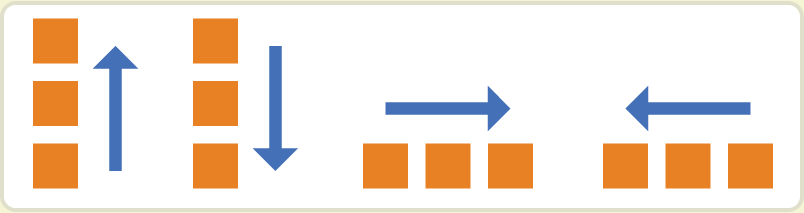

# Flex 布局

## 前言

[参考](https://ruanyifeng.com/blog/2015/07/flex-grammar.html)

Flex 布局，即 弹性布局，是 CSS3 中新增的布局方式，它允许开发者以一种更简洁的方式来定义元素在容器中的排列方式，从而实现更灵活的布局。

通过 `display: flex;` 或 `display: inline-flex` 来开启 Flex 布局。

```css
.box1 {
  display: flex;
}

.box2 {
  display: inline-flex;
}
```

:::info
设置为 Flex 布局后，子元素的 `float`、`clear`、`vertical-align` 属性将失效。
:::

### flex 与 inline-flex的区别

**display: flex 的特点**

- 块级弹性盒子：设置 `display: flex;`时，他会是一个带着块级特点的弹性盒子容器。
- 占据空间：因为拥有块级特点，因此它会占据芙蓉区的整个宽度，并且会独占一行。

**display: inline-flex 的特点**

- 行级弹性盒子：设置 `display: inline-flex;`时，他会是一个带有行级特点的弹性盒子容器。
- 占据空间：因为拥有行级的特点，因此他只占据所需的最小空间，且不会独占一行，可以与其他行级元素在一行显示。

## 基本概念

`flex` 布局容器拥有两根轴，默认**水平方向**为`主轴`、**垂直方向**为`交叉轴`。

默认情况下，容器内的元素，无论是行级元素还是块级元素都会按照主轴方向排列开来。

## 容器的样式

| 名称 | 描述 | 可用值 |
| --- | --- | --- |
| <nobr> flex-direction </nobr> | 设置主轴方向 | row / row-reverse / column / column-reverse |
| <nobr> flex-wrap </nobr> | 设置元素换行方式 | nowrap / wrap / wrap-reverse |
| <nobr> flex-flow </nobr> | 同时设置 `flex-direction` 和 `flex-wrap` | flex-flow: row wrap; |
| <nobr> justify-content </nobr> | 设置主轴对齐方式 | flex-start / flex-end / center / space-between / space-around |
| <nobr> align-items </nobr> | 设置交叉轴对齐方式 | flex-start / flex-end / center / baseline / stretch |
| <nobr> align-content </nobr> | 设置多根轴线对齐方式 | flex-start / flex-end / center / space-between / space-around / stretch |

### flex-direction

`flex-direction` 决定了主轴的方向。

- **row**：主轴为水平方向，起点在左端。
- **row-reverse**：主轴为水平方向，起点在右端。
- **column**：主轴为垂直方向，起点在上沿。
- **column-reverse**：主轴为垂直方向，起点在下沿。



### flex-wrap

`flex-wrap` 决定如何换行。正常情况下在容器尺寸不足时，元素会换行并继续按照主轴方向排列。

`Flex 布局`中提供了多种灵活的换行方式

- nowrap：不换行，元素会溢出容器。
- wrap：正常换行。
- wrap-reverse：换行，但换行方向相反。

