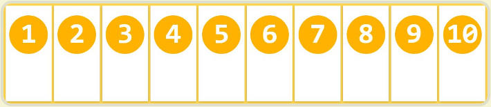
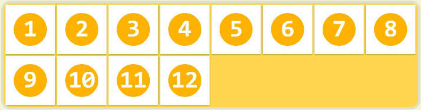
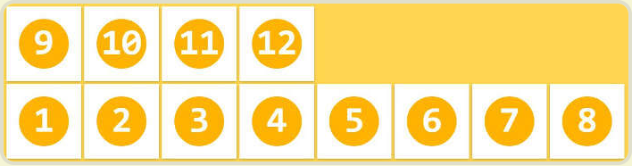
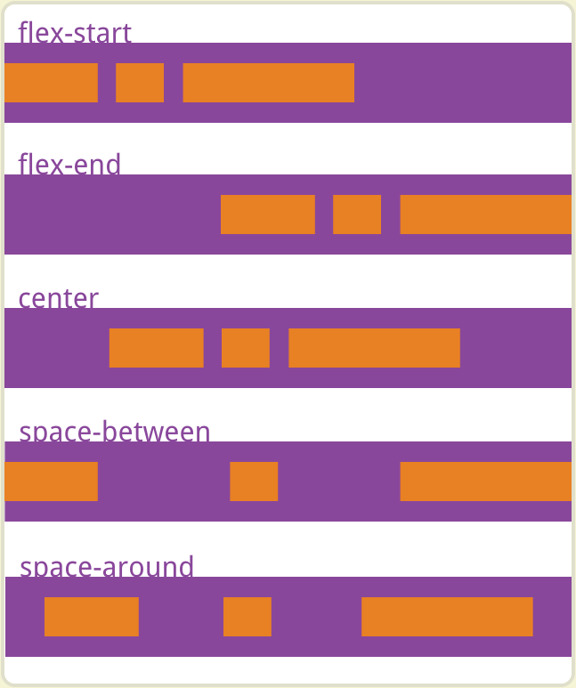
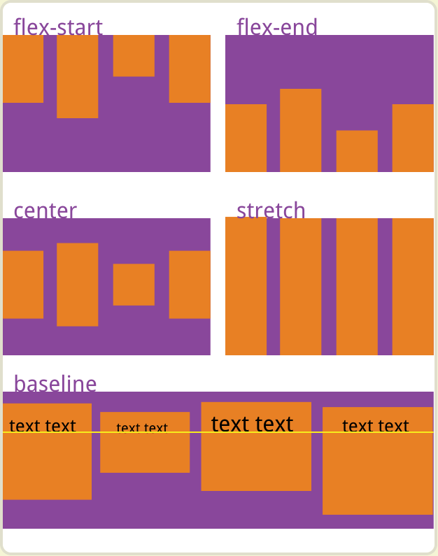
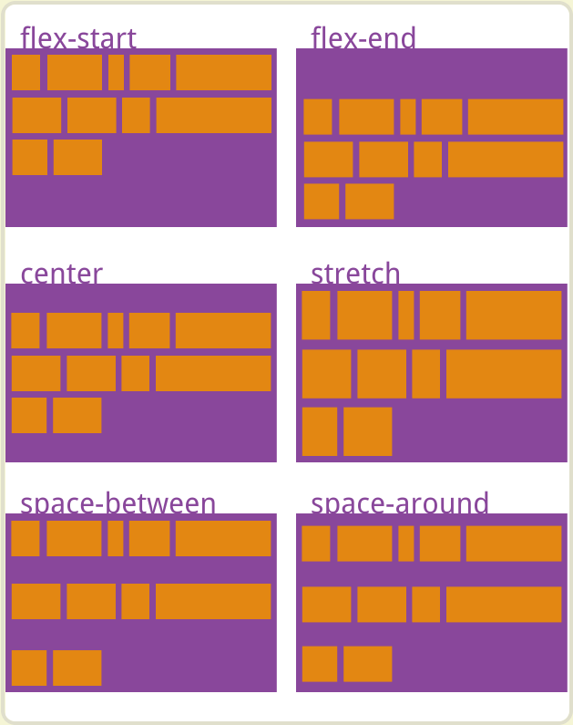
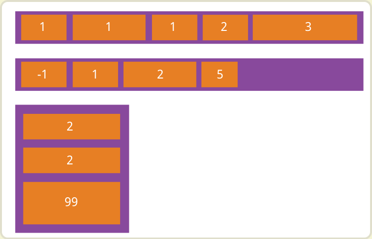
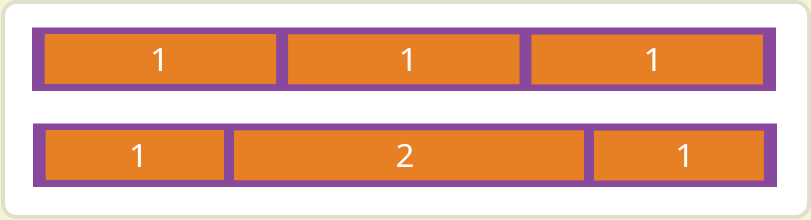
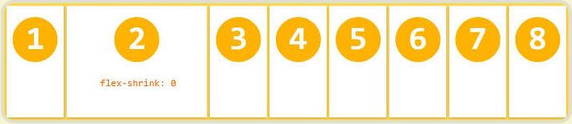

# Flex 布局

## 前言

[参考](https://ruanyifeng.com/blog/2015/07/flex-grammar.html)

Flex 布局，即 弹性布局，是 CSS3 中新增的布局方式，它允许开发者以一种更简洁的方式来定义元素在容器中的排列方式，从而实现更灵活的布局。

通过 `display: flex;` 或 `display: inline-flex` 来开启 Flex 布局。

```css
.box1 {
  display: flex;
}

.box2 {
  display: inline-flex;
}
```

:::info
设置为 Flex 布局后，子元素的 `float`、`clear`、`vertical-align` 属性将失效。
:::

### flex 与 inline-flex的区别

**display: flex 的特点**

- 块级弹性盒子：设置 `display: flex;`时，他会是一个带着块级特点的弹性盒子容器。
- 占据空间：因为拥有块级特点，因此它会占据芙蓉区的整个宽度，并且会独占一行。

**display: inline-flex 的特点**

- 行级弹性盒子：设置 `display: inline-flex;`时，他会是一个带有行级特点的弹性盒子容器。
- 占据空间：因为拥有行级的特点，因此他只占据所需的最小空间，且不会独占一行，可以与其他行级元素在一行显示。

## 基本概念

`flex` 布局容器拥有两根轴，默认**水平方向**为`主轴`、**垂直方向**为`交叉轴`。

默认情况下，容器内的元素，无论是行级元素还是块级元素都会按照主轴方向排列开来。

## 容器的样式

| 名称 | 描述 | 可用值 |
| --- | --- | --- |
| <nobr> flex-direction </nobr> | 设置主轴方向 | row / row-reverse / column / column-reverse |
| <nobr> flex-wrap </nobr> | 设置元素换行方式 | nowrap / wrap / wrap-reverse |
| <nobr> flex-flow </nobr> | 同时设置 `flex-direction` 和 `flex-wrap` | flex-flow: row wrap; |
| <nobr> justify-content </nobr> | 设置主轴对齐方式 | flex-start / flex-end / center / space-between / space-around |
| <nobr> align-items </nobr> | 设置交叉轴对齐方式 | flex-start / flex-end / center / baseline / stretch |
| <nobr> align-content </nobr> | 设置多根轴线对齐方式 | flex-start / flex-end / center / space-between / space-around / stretch |

### flex-direction（主轴方向）

`flex-direction` 决定了主轴的方向。

- **row**：主轴为水平方向，起点在左端。
- **row-reverse**：主轴为水平方向，起点在右端。
- **column**：主轴为垂直方向，起点在上沿。
- **column-reverse**：主轴为垂直方向，起点在下沿。


### flex-wrap（换行）

`flex-wrap` 决定如何换行。正常情况下在容器尺寸不足时，元素会换行并继续按照主轴方向排列。

`Flex 布局`中提供了多种灵活的换行方式

- **nowrap**：（默认）不换行，元素会溢出容器。

- **wrap**：正常换行。

- **wrap-reverse**：换行，但换行方向相反。


### flex-flow（主轴方向 换行）

`flex-flow` 是 `flex-direction` 和 `flex-wrap` 的结合，默认值为 `row nowrap`。

他的参数有两个，第一个用于设置 `flex-direction`，第二个用于设置 `flex-wrap`。

```css
.box {
  flex-flow: <flex-direction> || <flex-wrap>;
}
```

### justify-content（主轴对其方式）

`justify-content` 属性决定主轴上的对齐方式。

注意是主轴方向的对齐方式，因为 `flex 布局` 可以使用 `flex-direction` 来改变主轴，因此主轴不是一直都是水平方向。

- flex-start：（默认）左对齐
- flex-end：右对齐
- center：居中
- spance-between：两队对齐，项目之间间隔相等
- spance-around：每个项目两侧相等，因此项目之间的间隔比项目与边框的间隔大一倍。



### align-items（交叉轴对齐方式）

`align-items` 属性决定交叉轴上的对齐方式。

- flex-start：交叉轴起点对齐
- flex-end：交叉轴终点对齐
- center：交叉轴中点对齐
- baseline：项目第一行文字基线对齐
- stretch：（默认）如果未设置高度或设置为auto时，沾满整个容器



### align-content

`align-content` 属性定义了多根轴线的对齐方式，如果项目只有一根轴线，该属性不起作用

- flex-start：与交叉轴的起点对齐
- flex-end：与交叉轴的终点对齐
- center：交叉轴的中点对齐
- space-between：与交叉轴两端对齐，轴线之间的间隔平均分布
- space-around：根轴线两侧的间隔都相等。所以，轴线之间的间隔比轴线与边框的间隔大一倍
- stretch：（默认）轴线占满整个交叉轴



## 子元素的样式

以下的样式需要设置在 `flex` 容器的子元素上

- order
- flex-grow
- flex-shrink
- flex-basis
- flex
- align-self

### order

`order` 属性用于对容器内子元素进行排序，值越小，排列越靠前，默认为 0。

```html
<div class="box">
  <div class="item-1">1</div>
  <div class="item-2">2</div>
  <div class="item-3">3</div>
  ...
</div>
```
```css
.box { display: flex; }

.item-1 { order: 1; }
.item-2 { order: 2; }
...
```



### flex-grow

`flex-grow` 用于设置容器内子元素的放大比例，默认为0（即就算存在剩余空间，也不放大）。

```css
.item-1 {
  flex-grow: <number>; /* default 0 */
}
```



如果所有项目的 `flex-grow` 属性都为1，则它们将等分剩余空间（如果有的话）。如果一个项目的 `flex-grow` 属性为2，其他项目都为1，则前者占据的剩余空间将比其他项多一倍。

### flex-shrink

`flex-shrink` 属性定义了项目的缩小比例，默认为1，即如果空间不足，该项目将缩小。

```css
.item-1 {
  flex-shrink: <number>; /* default 1 */
}
```



如果所有项目的 `flex-shrink` 属性都为1，当空间不足时，都将等比例缩小。如果一个项目的 `flex-shrink` 属性为0，其他项目都为1，则空间不足时，前者不缩小。

负值对该属性无效。

### flex-basis

### flex

### align-self