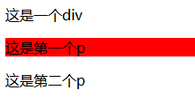
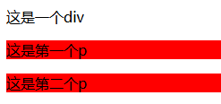
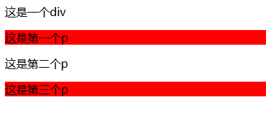
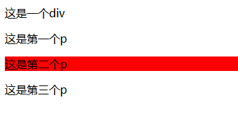

# CSS3 选择器

在 CSS3 中新增了几种选择器，有一些在 CSS 选择器中已经讲过了。

## 关系选择器

`E + F`：**下一个**满足条件的**同级**元素节点

```css
div + p {
  background: red;
}
```
```html
<div>这是一个div</div>
<p>这是第一个p</p>
<p>这是第二个p</p>
```


`E ~ F`：满足条件的**所有同级**元素节点

```css
div ~ p {
  background: red;
}
```
```html
<div>这是一个div</div>
<p>这是第一个p</p>
<p>这是第二个p</p>
```



## 属性选择器

在 CSS 选择器里其实已经写了

`E(attr ~= "val")`：属性存在独立一个 val 值的元素

`E(attr |= "val")`：以 val 开头或以 val-开头的元素

`E(attr ^= "val")`：以 val 开头的元素

`E(attr $= "val")`：以 val 结尾的元素

`E(attr *= "val")`：包含 val 的元素

## 伪元素选择器

`E::placeholder`：可以设置placehodler的样式，如 input 框中，placeholder 的 color

`E::selection`：可以设置 select 中文字选中时的 color、background-color、text-shadow等

## 伪类选择器

`:root`：跟标签选择器

`:target`：选中点击 a 标签后，锚点位置的样式。如下面的例子 `#section1` 被选中时 对应的锚点位置（id="section1"）会被添加样式

```html
<a href="#section1">Go to Section 1</a>
<div id="section1">
  <h2>Section 1</h2>
  <p>This is section one.</p>
</div>
```
```css
div:target {
  background-color: #d1e7dd;
  border-left: 5px solid #198754;
}
```

`E:not(s)`：E元素中，不满足 s 条件的元素

### 可被其他元素影响的选择器

> 使用这些选择其会考虑所有兄弟元素，而不仅仅是特定类型的元素（E）

`E:first-child`：选中第一个同及子元素

`E:last-child`：选中最后一个同级子元素

`E:only-child`：选中唯一的元素

`E:nth-child(n)`：根据 n 条件选择元素

```html
<div>这是一个div</div>
<p>这是第一个p</p>
<p>这是第二个p</p>
<p>这是第三个p</p>
```
```css
/* 偶数p背景色为红色 */
p:nth-child(2n) {
  background: red;
}
```



这里可以看到由于 `nth-child` 中的条件不仅考虑特定类型 p，还考虑了 div，因此将为第一个 p 元素设置了背景色

### 以下选择器不考虑其他元素对其的影响（推荐）

`E:first-of-type`：第一个

`E:last-of-type`：最后一个

`E:only-of-type`：唯一的

`E:nth-of-type(n)`：满足条件的（常用）

```html
<div>这是一个div</div>
<p>这是第一个p</p>
<p>这是第二个p</p>
<p>这是第三个p</p>
```
```css
/* 偶数p背景色为红色 */
p:nth-of-child(2n) {
  background: red;
}
```



这里因为 `nth-of-child` 中的条件只考虑特定类型 p，因此将第二个 p 元素设置了背景色


## input属性相关的选择器

`E:checked`：元素被选中 （input type="checkbox"）

`E:enabled`：匹配每一个启用状态的input元素（主要用于表但，没有被 disabled 的元素）

`E:disabled`：带有 disabled 属性的input元素

`E:read-only`：带有 readonly 属性的input元素

`E:read-write`：带有 readwrite 属性的input元素