# docker 安装

Docker 可以运行在 Mac、Windows 和绝大多数 Linux （CentOS、Ubuntu）系统上。

## Windows 安装 Docker

> 网址：https://www.docker.com/

### 1.下载 Docker

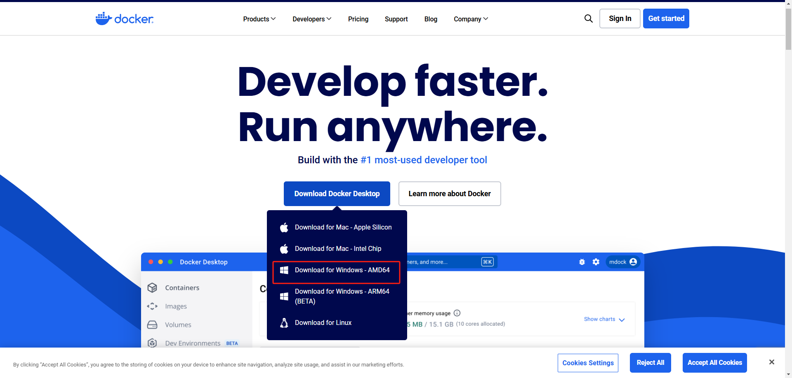

### 2.开启Hyper-V

> 选择虚拟机平台
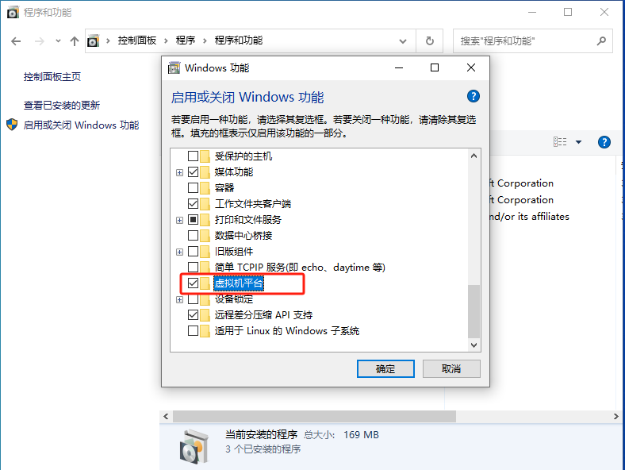

> 选择 Hyper-V
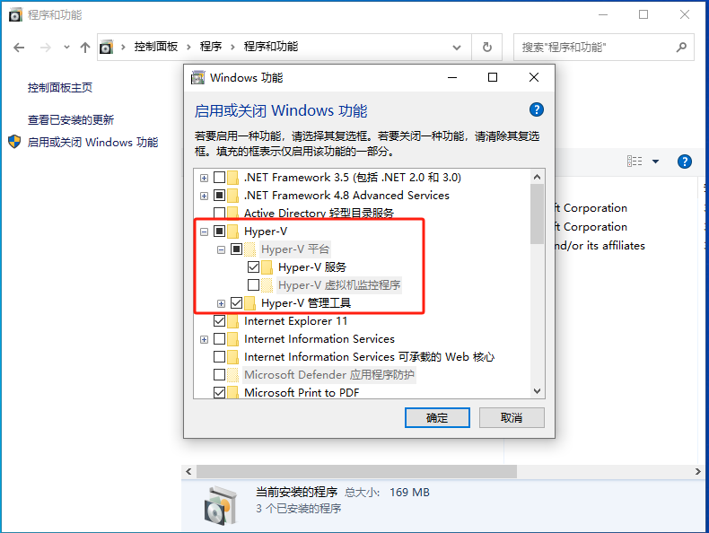

> 选择适用于 Linux 的 Windows 子系统
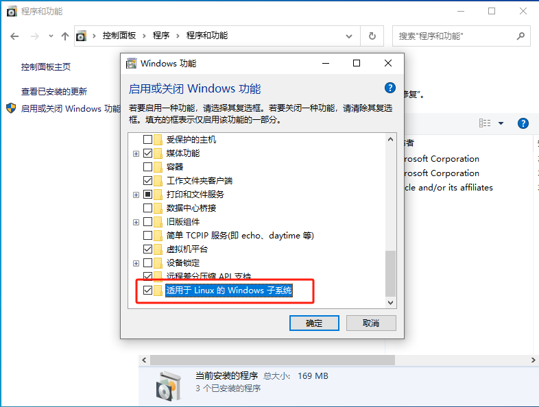

### 3.安装 Docker

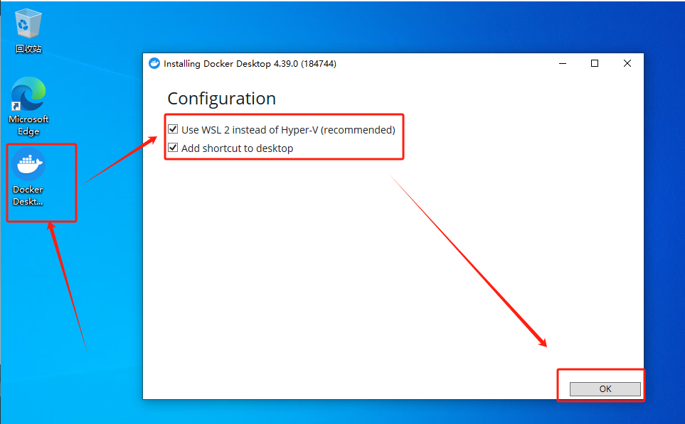

安装成功后重启 Windows，再启动安装好的 Docker Desktop

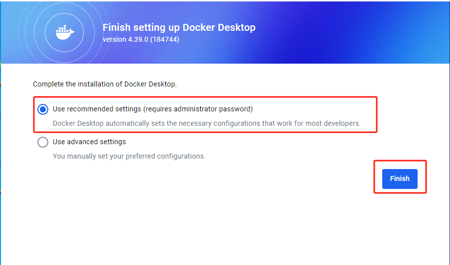

可以暂时先不登录

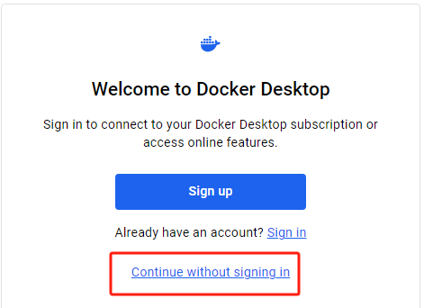

如果出现WSL2 的错误可以再下面 **常见问题** 部分找到应对 WSL2 的说明

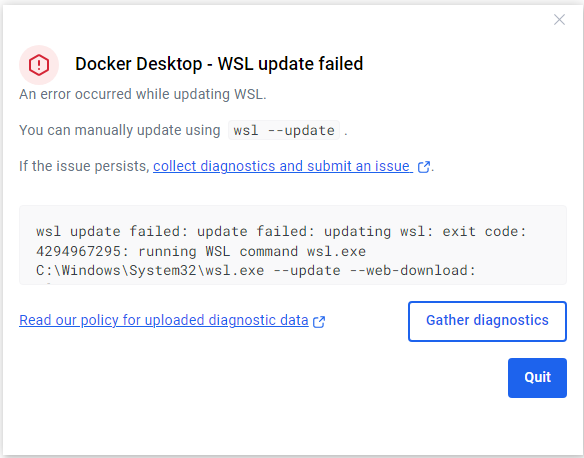

### 问题

有的可能会提示一些异常错误，下面来介绍几种常见的问题和解决办法

#### window10 版本不兼容

window10 版本不兼容的问题，可以使用 winver 命令查看当前系统的版本，如果确实低于 Docker 支持的版本那么就需要升级了。

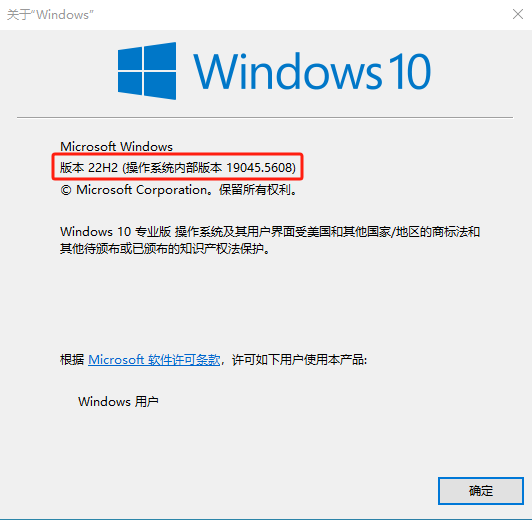

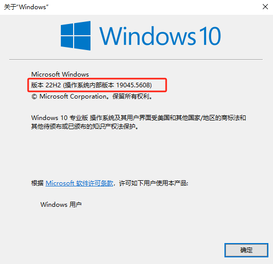

升级window系统：

1.打开开始菜单-选择设置

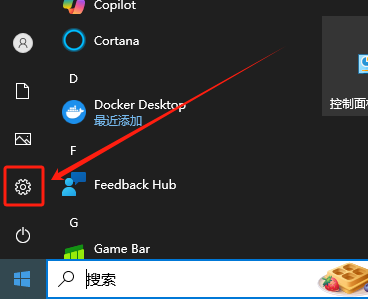

2.在 **设置** 的最下面找到 **更新和安全**

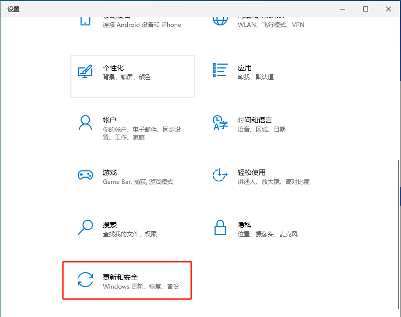

3.在 **Windows 更新** 中选择 **检查更新**，如果有可更近的版本就会推送更新

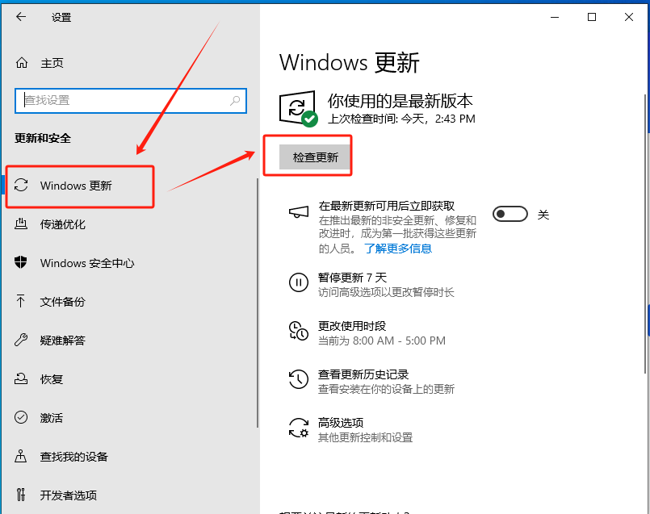

## Linux 安装 Docker