# CherryStudio + siliconflow 构建AI知识库

本篇将介绍如何使用 [CherryStudio](https://github.com/CherryHQ/cherry-studio) + [siliconflow](https://www.siliconflow.cn/) 构建一个AI知识库。

## 准备工作

1.下载安装 [Cherry Studio](https://www.cherry-ai.com/download)

这是一个用于统一调度各类大模型的工具。集对话、图生成、翻译、知识库等多项功能于一体的应用。

2.注册登录 [硅基流动](https://cloud.siliconflow.cn/i/TAAOvaXg)

这是一个一站式大模型云服务平台，申请一个key后可以一站式使用各类大模型。

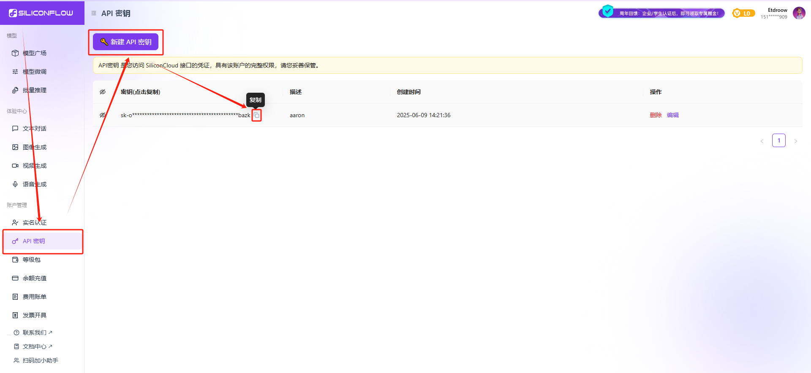

## 搭建知识库

### 1.打开 `Cherry Studio`

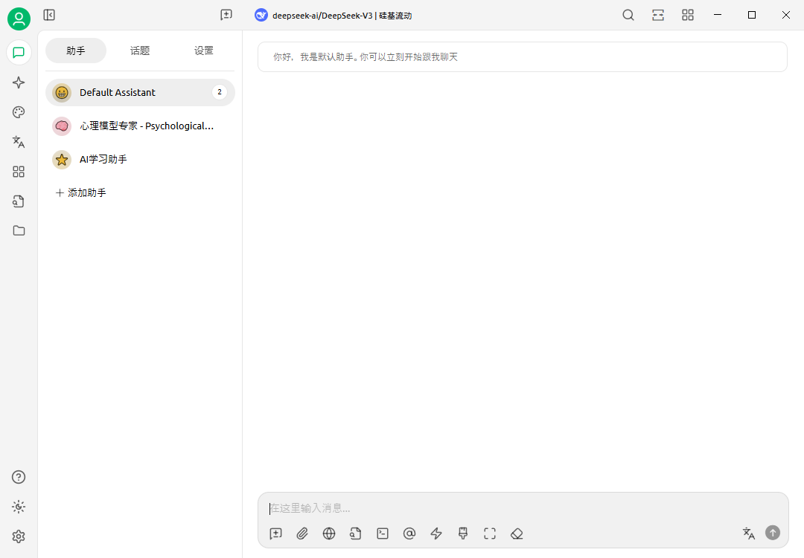

### 2.设置密钥

点击 `设置`，选择 `硅基流动`，点击右上角启用，并填入 `API密钥`

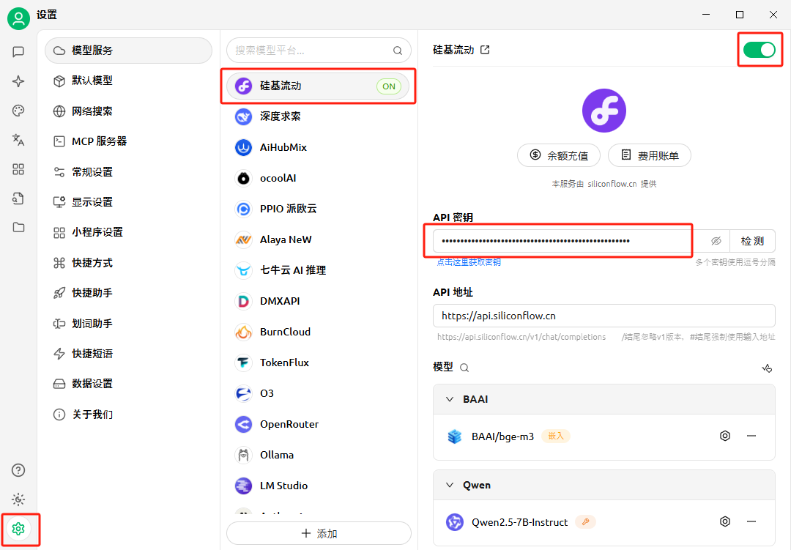

### 3.添加模型

这里会有一些默认模型，如果需要更多模型可以点击下面的 `添加` 按钮进行添加

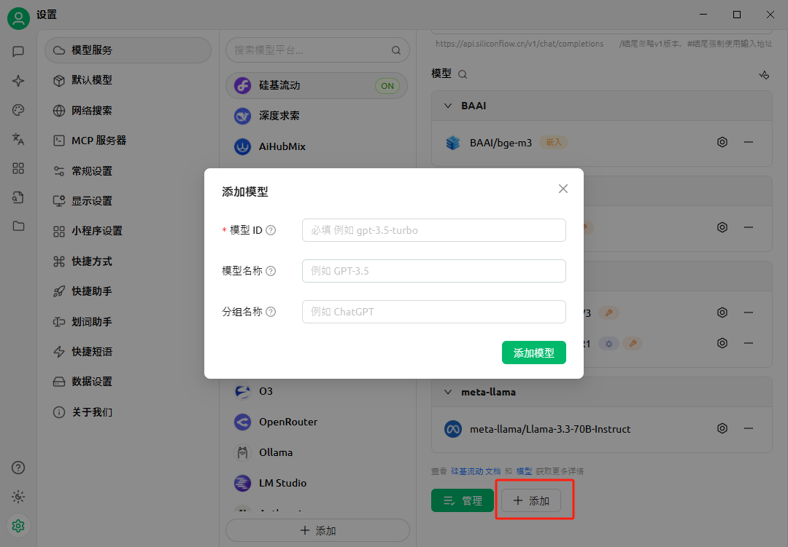

> 制作知识库需要两个模型
> 一个是用于对话的 **大语言模型**
> 一个是用于将本地文件转换为向量数据的 **嵌入模型**

### 4.添加 **大语言模型**

在模型广场选择自己想要用的大语言模型，我这里选择了 `deepseek-ai/DeepSeek-R1`，复制它的名称

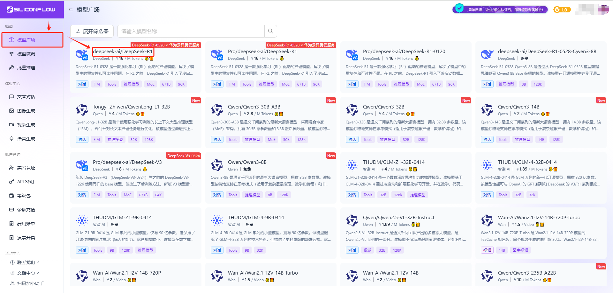

将名称粘贴到 `模型ID` 的输入框内，如果输入正确的话下面的 `模型名称` 和 `分组名称` 会自动生成

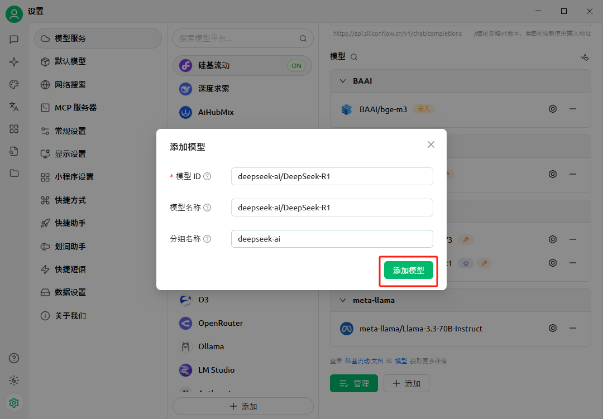

成功添加后 `模型` 会出现在对应的分组下

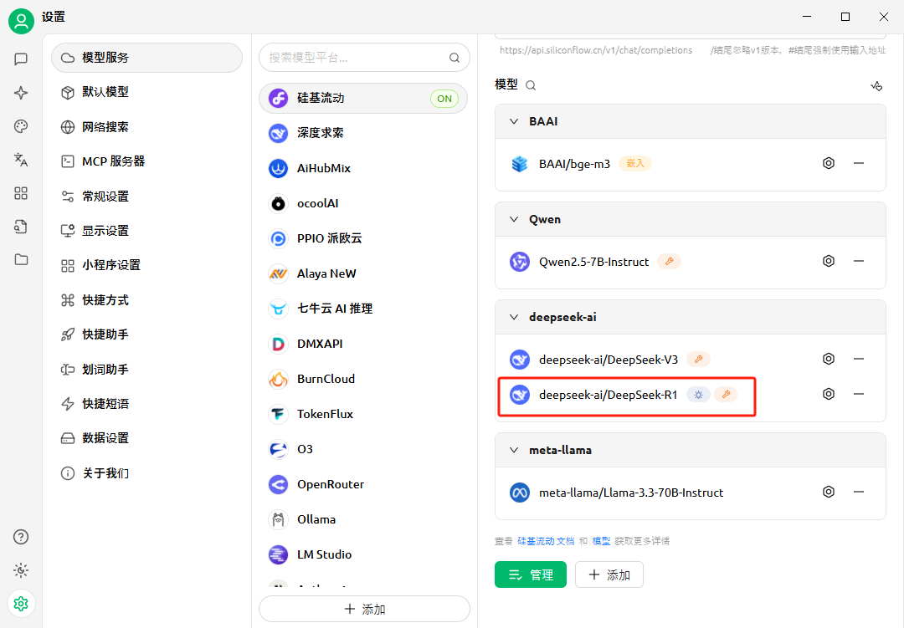

### 5.添加 **嵌入模型**

画面的筛选功能可以帮助我们快速找到想要的 **嵌入模型**，我这里选择了 `BAAI/bge-m3`，添加步骤和上面一样，也是复制名称到 `Cherry Studio` 里粘贴。

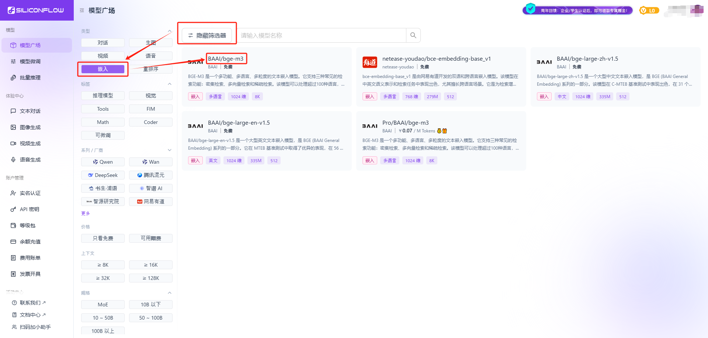

### 6.创建知识库

进入`知识库`界面，选择 `添加`，这里的知识库名称可以随便起，`嵌入模型` 就选刚刚添加的模型 `BAAI/bge-m3`

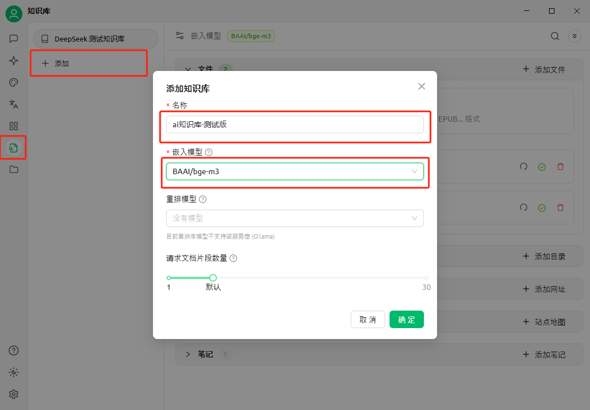

### 7.上传文件

将文件上传到知识库中，成功后文件后会出现一个对号的小图标

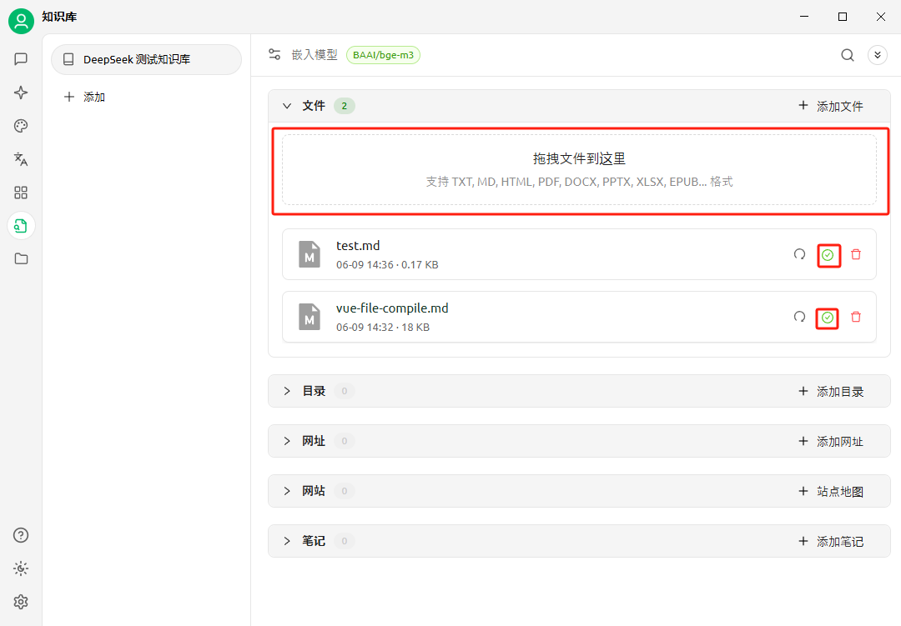

### 8.添加/选择助手

在 `助手` 界面，选择/添加助手，在助手上右键选择 `编辑助手`

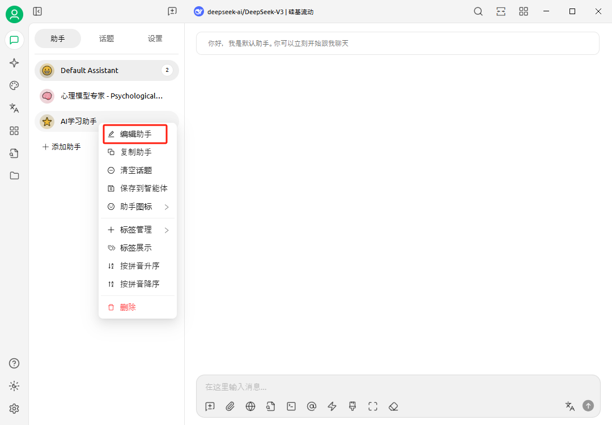

### 9.设置知识库

在编辑界面为此助手设置可调用的知识库

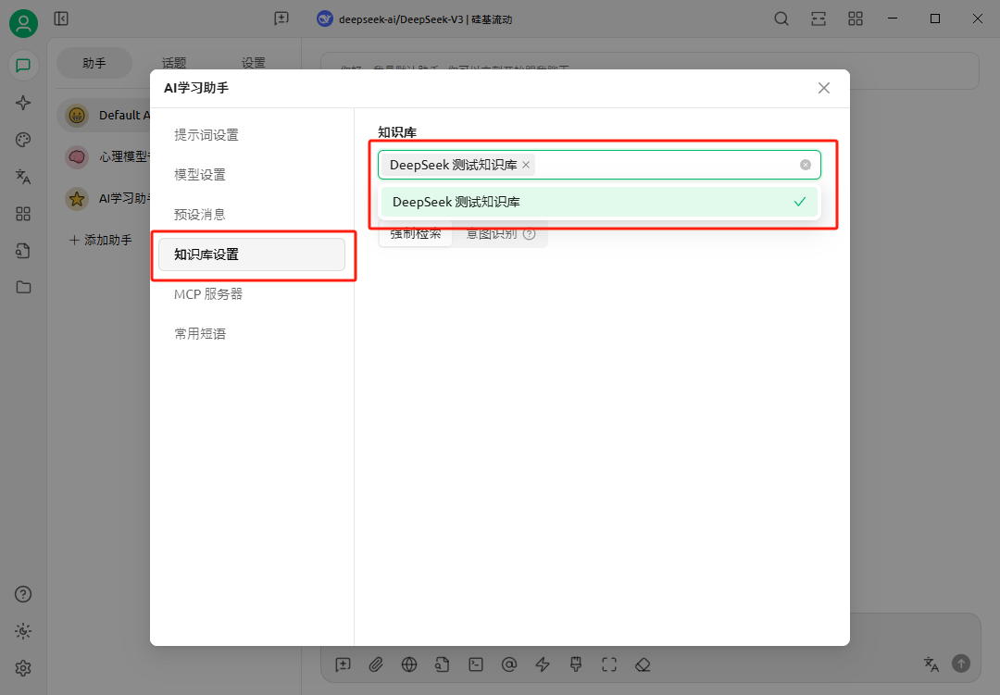

### 10.选择对话模型

在顶部可以调整用来对话的大语言模型

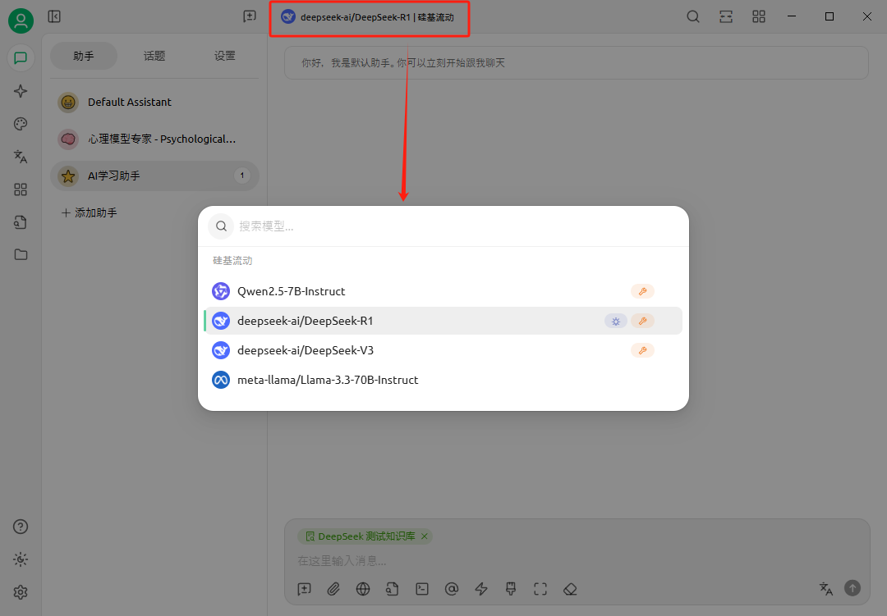

### 11.对话

接下来就可以进行对话了，

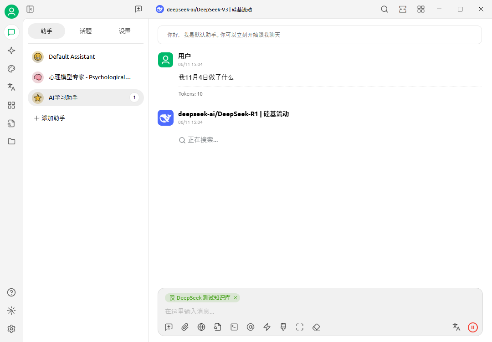