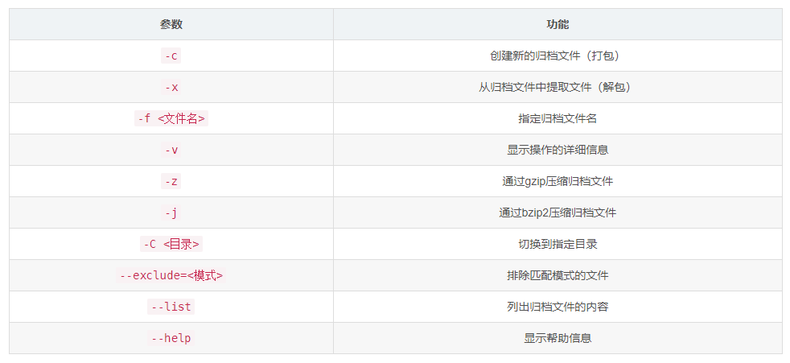

# Linux 基本命令

## 普通命令

- cd：切换目录
- pwd：显示当前工作目录绝对路径
- ll：查看当前目录下的文件，不包括隐藏文件
- ls -al：查看当前目录的文件，包括隐藏文件
- mkdir：创建目录，只能在存在的路径下进行创建
- mkdir -p：如果，如果上级路径不存在将上级目录也一起创建
- rmdir：删除目录，只能删除目录中没有文件的目录
- touch：创建文件
- cp：复制文件 目标位置 (可以重命名)
- cp -r：递归赋值，多级目录
- mv：移动文件 目标位置 (可以重命名)
- rm：删除文件
- rm -rf：删除路径以及路径下所有文件
- tail -行数 文件名：根据行数查找文件中最后的那几行，如果不写行数默认为最后10行
- tail -F：实时刷新
- grep：搜索内容
    - ll |grep "ssl"：查找文件名以ssl开头的文件
- tail -F 文件名 |grep "内容"：查找文件中以内容开头的行
    - tail -F b.txt |grep "A:"： 查看文件b.txt中以A:开头的行
- cat：查看文件（全文），也可以配合grep使用，在cat中可以用多次grep
    - cat b.txt |grep "A:" |grep "3"
- less：查看文件（分页）上下键翻页
- more：查看文件
- history：查看已经执行过的历史命令
- echo 内容 > 文件名：将内容写入文件
- chmod 权限 文件名：修改文件权限
    - chmod 777 文件名：修改文件权限为777

## 网络命令

- ping 【host】：确认通信状况
- telnet：ip端口，查看端口是否占用（如果没有此命令可以执行 【yum install telent】进行下载）
- wget 【file】：下载文件
- hostname：查看主机名
- ip route show：查看网关

## 系统信息命令

- date：查看当前系统时间
- date -s：修改时间
- w：显示登录用户
- uname -a：查看系统内核
- cat /proc/cpuinfo：查看cpu信息

## 常用的其他命令

- lscpu：查看当前机器cpu信息
- df：查看磁盘空间（ -h， -i）
- ps aux：查看系统上启动的服务
- ps aux lgrep “服务”：查看此服务是否启用（如果启用这会有多条，没启用会有1条或0条）、
- top：查看资源占用情况，类似windows任务管理器
    - 主要有以下几个数据需要观察
    - CPU：cpu使用率
    - MEM：内存使用率
- systemctl disable firewalld：取消防火墙服务，关闭防火墙后必须重启，否则不生效
- curl 网址：向目标发送http请求
    - -i：获取响应头
- history：查看之前使用过的命令
- whereis：查看命令在Linux系统中的位置
    - whereis cd：这个就是查询cd命令在Linux中的位置
-echo $PATH：输出所有环境变量所处的位置
- find -name 文件名：根据文件名查询当前文件夹下的文件位置（对文件夹递归）

## 压缩解压

- tar
    - tar -cvf 【压缩后文件名】.tar 【目标文件位置】：压缩文件
    - tar -xvf 【解压文件名】：解压文件
    - tar -zcvf 【压缩后文件名】.tar 【目标文件位置】：压缩文件
    - tar -xzvf 【解压文件名】：解压gzip文件


- zip：前提 安装zip和unzip
    - zip -r 【压缩后文件名】.zip 【目标文件位置】：压缩目标路径下文件
    - unzip 【压缩文件名】：解压文件

## vi

- vi + 文件名：创建文件并进入（此时是不可输入的）
- `i`：进入输入模式（按小键盘的数字也会进入输入模式）
    - `esc`：退出输入模式
- `上下左右/kjhl`：移动光标
    - 输入数字在按上下左右（或kjhl）表示移动多少位置，比如输入 5j 表示向下移动5行
- `ctrl + f`： 向下翻页
- `ctrl + b`： 向上翻页
- `ctrl + d`： 向下滚半页
- `ctrl + u`： 向上滚半页
- `home`： 光标移动到行首
- `end`： 光标移动到行尾
- `gg`： 光标移动到文件开头
- `G`： 光标移动到文件末尾
- `数字 + G`： 光标移动到指定（数字）行
- `/要查找的字符`： 向下查找指定字符
- `?要查找的字符`： 向上查找指定字符
- `dd`：删除行
- `u`： 撤销上一步操作
- `:`：在文件中输入冒号 `:` 进入命令行模式
    - `w`：保存文件
    - `q`：退出文件
    - `:wq`：保存并退出文件

## shell脚本

shell脚本，本身就是一个文件，它以 `.sh` 为后缀，使用时会对文件的每一行进行执行。

我们可以创建一个sh结尾的文件如 `doit.sh`，在文件中写入以下内容

```shell
mv a.txt b.txt
cp b.txt ./test/b.txt
```

然后，我们可以执行这个脚本文件，即 `sh doit.sh` 或 `./doit.sh`

**可能会出现错误**： `-bash: ./doit.sh: Permission denied`，这说明我们没有权限执行这个脚本文件。

我们可以使用 `chmod` 命令给脚本文件添加执行权限，如 `chmod +x doit.sh` 或更简单的 `chmod 777 doit.sh`

## 文件赋权

在使用 `ll` 查看文件时，在最前方会有一个以 `-` 开头的权限字符串，如 `-rw-r--r--`。

10个字符，可以分成四组 ，第一个字符自己一组，之后每三个一组
- 第一个字符：文件类型
- 三个字符：拥有者权限
- 三个字符：用户组权限
- 三个字符：其他组权限

**文件类型的字符含义如下**：
- `-`：普通文件
- `d`：目录
- `l`：链接文件

**代表权限的字符串中的字符含义如下**：
- r：读权限，代表数字 `4`
- w：写权限，代表数字 `2`
- x：执行权限，代表数字 `1`
- -：无权限

赋予权限时可以根据数字的计算赋予权限，比如 `4+2+1=7`，表示 `rwx`，`4+2=6`,表示`rw`

如果要为**所有人**赋予**读写执行**权限：chmod 777 filename
如果要为**拥有者**赋予**读执行**权限：chmod 500 filename

## 进程

- ps： 查看进程
    - ps aux： 查看所有正在执行的进程
        - 第一行：权限
        - 第二行：进程ID
    - ps aux |grep "top"： 查看执行top的进程
- kill：结束进程
    - kill 进程ID：结束目标进程
    - kill -9 进程ID：强制结束目标进程
