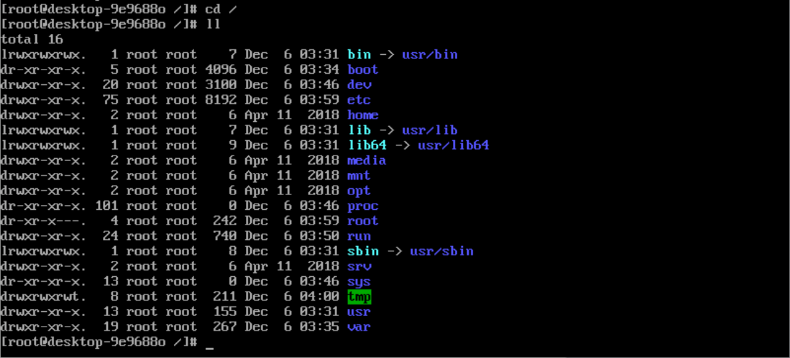

# Linux 目录

linux 遵循 FHS 协议，统一 linux根目录

## FHS协议

FHS(Filesystem Hierarchy Standard)，文件系统层次化标准

## 根目录下文件夹

- 1）usr：用户程序，与软件安装有关
- 2）var：变量文件，和系统运行相关
- 3）bin：用户二进制文件，储存可执行文件，【相当于windows环境变量中的命令】
- 4）boot：引导加载程序文件，和系统开机相关【如：reboot重启】
- 5）dev：设备文件，以文件的形式存在此目录下，包括终端设备、usb或连接到系统的任何设备
- 6）etc：配置文件，存放程序所需的配置文件
- 7）home：用户目录，存储所有用户的个人档案【除了root用户】
- 8）root：root用户主目录
- 9）lib：系统库/函数库，存放系统函数
- 10）media：可移动媒体设备，存放着可移动设备的临时目录【光盘，u盘，dvd盘】
- 11）mnt：挂载目录，和media类似
- 12）opt：可选的附加应用程序，存放第三方软件目录，我们写的程序可以放在这里
- 13）sbin：系统二进制文件，只有系统管理员进行访问
- 14）srv：服务数据，存放用户主动生产的数据
- 15）tmp：临时文件，包含系统和用户的临时文件
- 16）proc：进程信息，虚拟文件系统不存在硬盘中，而是在内存中，关机后消失，存放系统内核、进程、外部设备的状态
- 17）sys：存放和系统相关的信息
- 18）Lost+found：有的系统没有，用于当文件系统发生错误时，将丢失问问捡碎片存在这里

