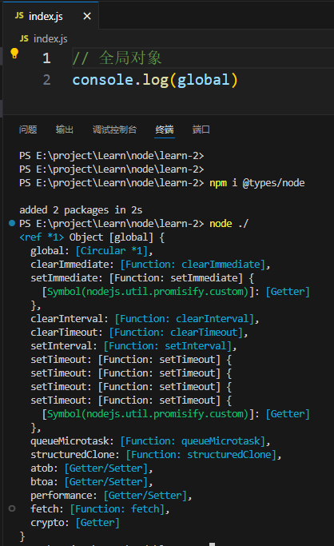
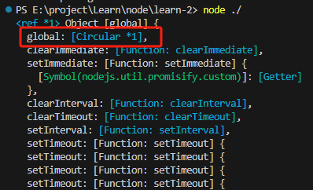
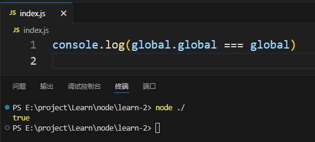
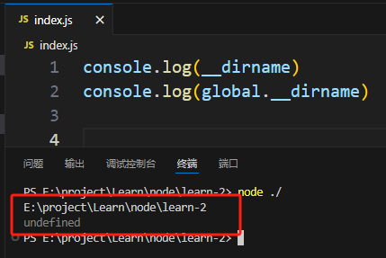
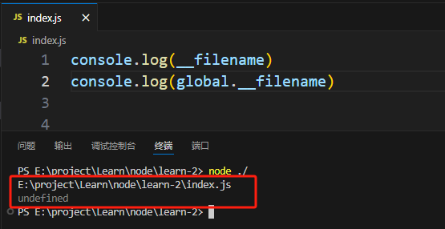
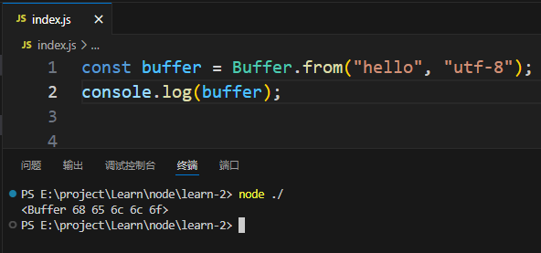
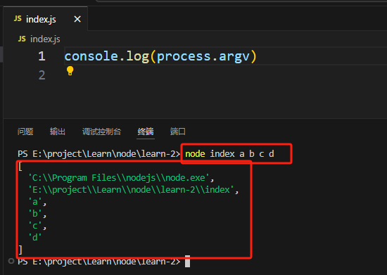
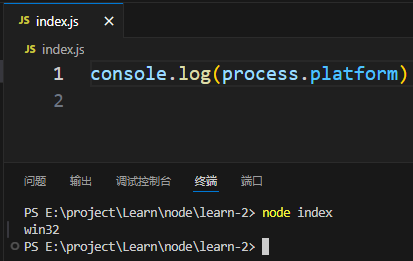

# node 全局对象

和 js 里一样，node 中也有全局对象，但是有些不同。

在 js 中全局对象是 `window`，而在 node 中全局对象是 `global`。



同js一样，全局对象内的属性都是可以直接使用的。

全局对象 `global` 中有同名属性 `global`，着代表着全局对象本身。





它的赋值方式相当于：

```js
var obj = {};
obj.obj = obj;
```
## 常用的属性、函数

- setTimeout：与js中的用法相同，不过js中返回值是一个数字，node中返回一个对象
- setInterval：与js中的用法相同，不过js中返回值是一个数字，node中返回一个对象
- setImmediate：立即执行的，其效果类似于 `setTimeout(fn, 0)`
- console：控制台输出
- __dirname：当前文件所在的目录，它不是 `global` 的属性



- __filename：获取当前模块的文件路径，它不是 `global` 的属性



- Buffer：缓冲区，用于处理二进制数据



- process
    - cwd()：返回当前node进程的工作目录
    - exit()：强制退出node进程，可以传入一个参数，表示退出时的状态码
    - argv：返回 String[]，获取执行代码时命令中所有的参数

    

    - platform：表示当前操作系统

    

    - kill(pid)：用于杀死进程
    - env：获取环境变量
