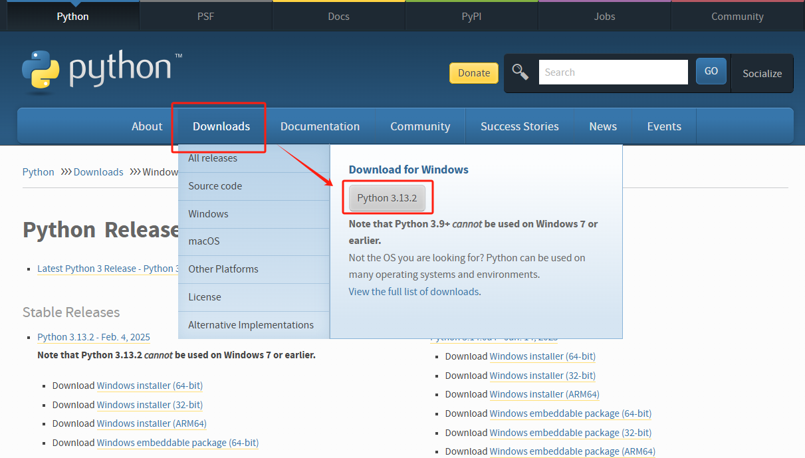
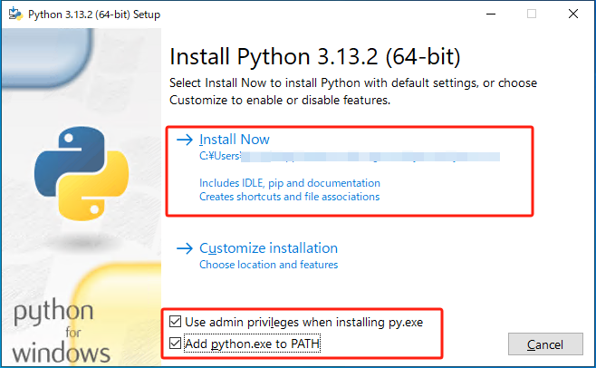
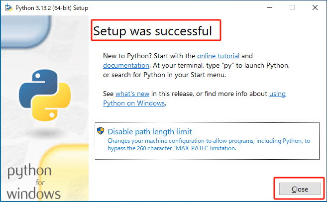

# Python 环境搭建

## Python 下载

安装包下载地址：https://www.python.org/downloads/



## Python 安装





查看当前系统的 Python 版本，确认安装成功

```bash
python -V
```

## Python 常用命令行参数

- python -V 或 python --version
  - 查看当前 Python 版本
- python -c <command>
  - 直接运行单行 Python 代码
  - 示例：python -c "print('Hello World')"
- python -m <module>
  - 以脚本形式运行模块
  - 示例：python -m http.server （启动一个简单的 HTTP 服务器）
- python -i <script.py>
  - 运行脚本后进入交互模式，保留变量和状态
  - python -i script.py
- python -h 或 python --help
  - 查看 Python 命令行帮助信息
- python -m pip install <package>
  - 使用 `pip` 安装 Python 包
- python -m site
  - 查看 Python 的路径配置
  
## pip 介绍

`pip` 是 Python 的官方包管理工具（相当于前端的 npm）。它用于 `安装`、`管理`、`卸载` 第三方 Python 包，是在项目开发、脚本运行、构建应用程序时不可或缺的工具

主要要了解的功能：

- 安装包
- 卸载包
- 升级包
- 导出环境
- 配置镜像源

## 安装 pip

在 Python 2.7.9+ 和 Python 3.4+ 的版本中，`pip` 已经内置在 Python 中了，在安装 Python时会自动安装。

检查pip版本，确认是否已经安装：

```bash
pip -V 
或
pip --version
```

如果没有安装可以通过以下方式安装：

- Linux / macOS：
```bash
curl https://bootstrap.pypa.io/get-pip.py -o get-pip.py
python get-pip.py
```

- Windows：
下载 [get-pip.py](https://bootstrap.pypa.io/get-pip.py)，然后运行：
```bash
python get-pip.py
```

## pip 的基本用法

安装包

```bash
pip install <package_name>

# 例
pip install requests
```

安装指定版本包

```bash
pip install <package_name>==<version>

# 例
pip install requests==1.21.0
```

卸载包

```bash
pip uninstall <package_name>

# 例
pip uninstall requests
```

升级包

```bash
pip install --upgrade <package_name>

# 例
pip install --upgrade pip
```

列出已安装的包

```bash
pip list
```

查看包信息

```bash
pip show <package_name>

# 例
pip show pandas
```

导出依赖

```bash
pip freeze -> requirements.txt
```

安装依赖项

```bash
pip install -r requirements.txt
```

版本冲突（如果多个包依赖同一包的不同版本，可以使用 `pip check` 检查冲突）

```bash
pip check
```

清除缓存

```bash
pip cache purge
```

## pip 使用镜像加速

使用临时镜像源

```bash
pip install <package_name> -i <mirror_url>

# 例
pip install numpy -i https://pypi.tuna.tsinghua.edu.cn/simple
```

永久修改镜像源

```bash
pip config set global.index-url <mirror_url>

# 例
pip config set global.index-url https://pypi.tuna.tsinghua.edu.cn/simple
```
