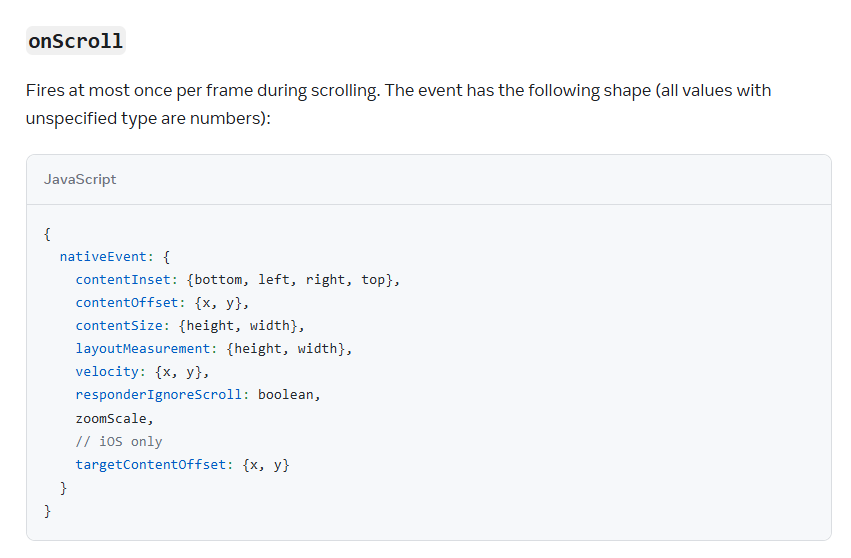

# 状态栏

[StatusBar Doc](https://reactnative.dev/docs/statusbar)


现在想做一个效果，当路由地址为 `/` 时隐藏状态栏，其他情况显示状态栏。

app/(_tabs)/_layout.tsx:

```tsx

import { DarkTheme, DefaultTheme, ThemeProvider, usePathname } from 'expo-router';
import { NativeTabs } from 'expo-router/unstable-native-tabs';
import { StatusBar, useColorScheme } from 'react-native';

export default function TabLayout() {
    const colorScheme = useColorScheme();
    // 获取路由地址
    const pathname = usePathname();

    return (
        <ThemeProvider value={colorScheme === 'dark' ? DarkTheme : DefaultTheme}>
            <StatusBar hidden={pathname === '/'} />
            <NativeTabs>
                <NativeTabs.Trigger name="index">
                    <NativeTabs.Trigger.Label>Home</NativeTabs.Trigger.Label>
                </NativeTabs.Trigger>
                <NativeTabs.Trigger name="settings">
                    <NativeTabs.Trigger.Label>Settings</NativeTabs.Trigger.Label>
                </NativeTabs.Trigger>
            </NativeTabs>
        </ThemeProvider>
    );
}
```

在Layout中，通过 `usePathname` 获取当前路由地址，然后通过 `StatusBar` 组件控制状态栏的显示与隐藏。

此外，还有一些属性如过渡效果（animated）等属性可以在文档中查找。

**为什么不再画面中直接控制？**

`StatusBar` 确实可以在单个画面中使用，但即使是在单个画面中，每次变化也会控制全局所有画面的状态栏，它相当于全局共享的状态，相比于在每个画面都写不如在 `Layout` 中统一控制。

## 常见配置

### 上滑时状态栏收起，下滑时状态栏显示

这是应用开发中常见的效果，尤其是信息流的应用里。

app/(tabs)/index.tsx 原代码：
```tsx
import { getFeeds } from "@/services/apiFeed";
import { useQuery } from "@tanstack/react-query";
import { FlatList, Text, View } from "react-native";
import { SafeAreaView } from "react-native-safe-area-context";

export default function () {
    const {
        data: feeds,
        isLoading,
        isSuccess,
        error,
    } = useQuery({
        queryKey: ["feeds"],
        queryFn: getFeeds,
    });
    
    type ItemProps = { title: string };

    const Item = ({ title }: ItemProps) => (
        <View>
            <Text>{title}</Text>
        </View>
    );

    return (
        <SafeAreaView edges={["bottom"]}>
            <View>
                <Text>Hello</Text>
            </View>
            <FlatList
                data={feeds}
                renderItem={({ item }) => <Item title={item.title} />}
                keyExtractor={(item) => item.id.toString()}
            />
        </SafeAreaView>
    );
}
```

app/(tabs)/_layout.tsx 原代码：

```tsx
import FontAwesome from "@expo/vector-icons/FontAwesome";
import { Tabs, usePathname } from "expo-router";
import { StatusBar } from "react-native";

export default function TabLayout() {
    const pathname = usePathname();

    return (
        <Tabs
            screenOptions={{
                tabBarActiveTintColor: "blue",
                headerShown: false,
            }}
        >
            <StatusBar hidden={pathname === "/"} />

            <Tabs.Screen
                name="index"
                options={{
                    tabBarIcon: ({ color }) => (
                        <FontAwesome size={28} name="home" color={color} />
                    ),
                }}
            />
            <Tabs.Screen
                name="settings"
                options={{
                    tabBarIcon: ({ color }) => (
                        <FontAwesome size={28} name="cog" color={color} />
                    ),
                }}
            />
        </Tabs>
    );
}
```

修改时需要获取 FlatList 的滚动状态。

[FlatList Props - VirtualizedList Props - ScrollView - onScroll](https://reactnative.dev/docs/scrollview#onscroll)



我们只需监听，上滑的时候隐藏状态栏，下滑的时候显示状态栏

app/(tabs)/index.tsx 修改后：

```tsx
import { getFeeds } from "@/services/apiFeed";
import { useQuery } from "@tanstack/react-query";
import { useState } from "react";
import {
  FlatList,
  NativeScrollEvent,
  NativeSyntheticEvent,
  StatusBar,
  Text,
  View,
} from "react-native";
import { SafeAreaView } from "react-native-safe-area-context";

export default function () {
    const {
        data: feeds,
        isLoading,
        isSuccess,
        error,
    } = useQuery({
        queryKey: ["feeds"],
        queryFn: getFeeds,
    });

    const [showStatusBar, setShowStatusBar] = useState(true);

    function handleScroll(event: NativeSyntheticEvent<NativeScrollEvent>) {
        const verticalScrollVelocity = event.nativeEvent.velocity?.y || 0;

        if (verticalScrollVelocity > 0) {
            console.log("表示在向下滑动");
            setShowStatusBar(false);
            return;
        }

        if (verticalScrollVelocity < 0) {
            setShowStatusBar(true);
        }
    }
    
    type ItemProps = { title: string };

    const Item = ({ title }: ItemProps) => (
        <View>
            <Text>{title}</Text>
        </View>
    );

    return (
        <SafeAreaView edges={["bottom"]}>
            <StatusBar hidden={!showStatusBar} />
            <View>
                <Text>Hello</Text>
            </View>
            <FlatList
                data={feeds}
                renderItem={({ item }) => <Item title={item.title} />}
                keyExtractor={(item) => item.id.toString()}
                // Android
                onScroll={handleScroll}
                // IOS
                onScrollEndDrag={handleScroll}
                scrollEventThrottle={160}
            />
        </SafeAreaView>
    );
}
```

- onScroll: Android
- onScrollEndDrag: IOS
- scrollEventThrottle: 设置事件触发的频率，默认为 16ms，即每 16ms 触发一次事件。


## Expo StatusBar

Expo 对 React Native 的 StatusBar 进行了封装，提供了更简单的 API。

[Expo StatusBar](https://docs.expo.dev/versions/latest/sdk/status-bar/)

需要进行安装：

```bash
npx expo install expo-status-bar
```

使用：

```tsx
import { getFeeds } from "@/services/apiFeed";
import { useQuery } from "@tanstack/react-query";
import { useState } from "react";
import {
  FlatList,
  NativeScrollEvent,
  NativeSyntheticEvent,
  Text,
  View,
} from "react-native";
import { SafeAreaView } from "react-native-safe-area-context";
import { StatusBar } from 'expo-status-bar';

export default function () {
    const {
        data: feeds,
        isLoading,
        isSuccess,
        error,
    } = useQuery({
        queryKey: ["feeds"],
        queryFn: getFeeds,
    });

    const [showStatusBar, setShowStatusBar] = useState(true);

    function handleScroll(event: NativeSyntheticEvent<NativeScrollEvent>) {
        const verticalScrollVelocity = event.nativeEvent.velocity?.y || 0;

        if (verticalScrollVelocity > 0) {
            console.log("表示在向下滑动");
            setShowStatusBar(false);
            return;
        }

        if (verticalScrollVelocity < 0) {
            setShowStatusBar(true);
        }
    }
    
    ...

    return (
        <SafeAreaView edges={["bottom"]}>
            <StatusBar style="auto" hidden={!showStatusBar} />
            <View>
                <Text>Hello</Text>
            </View>
            <FlatList
                data={feeds}
                renderItem={({ item }) => <Item title={item.title} />}
                keyExtractor={(item) => item.id.toString()}
                // Android
                onScroll={handleScroll}
                // IOS
                onScrollEndDrag={handleScroll}
                scrollEventThrottle={160}
            />
        </SafeAreaView>
    );
```

[Expo StatusBar Props](https://docs.expo.dev/versions/latest/sdk/status-bar/#component)

| 属性 | 效果 | 
| ---- | ---- |
| animated | 如果状态栏属性更改之间的过渡需要动画效果。支持 `style` 和 `hidden`。 |
| hidden | 控制状态栏显示隐藏 |
| hideTransitionAnimation | 使用 `hidden` 属性显示和隐藏状态栏时的过渡效果。 |
| style | 设置状态栏文本的颜色。默认值会 `auto` 根据当前激活的配色方案选择合适的值，例如：如果您的应用处于深色模式，则样式将为`light`。 |

