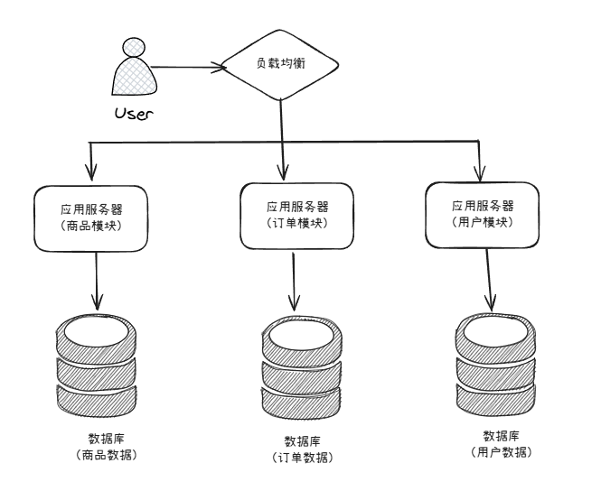
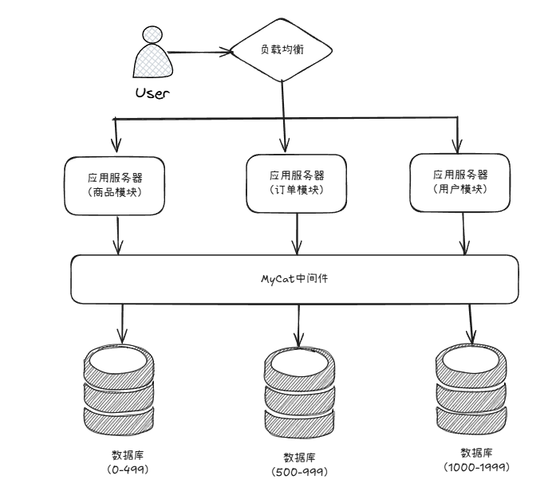

# Redis 介绍

解决项目中的缓存问题 

## 主要内容

- 数据类型
- 命令
- 配置
- 持久化
- 管道
- 事务
- 分布式锁
- 主从复制
- 哨兵模式
- 集群
- 客户端
- 应用场景

## 数据库架构发展

传统数据库的扩展性差（需要复杂的技术来实现），大数据下IO压力大（硬盘读写缓慢），表结构更改困难

发展流程：
- 单库：最初的数据读写由单个数据库完成
    - 随着访问量增加而出现性能问题
- 缓存：数据访问量过高后，发展为将数据缓存到内存中，提高访问速度（内存读写远快于硬盘）
    - 通过缓存，缓解数据库的压力，优化数据结构和索引
- 读写分离：访问量进一步增长，缓存也无法解决时，开始以读写分离的方式解决
    - 数据写入压力增加，主从复制和读写的方案进入视野
- 分库分表：访问量再次增长，开始再次分割数据库
    - 主库的写压力过高，开始使用InnoDB引擎，以及分库技术

## 单库架构和主从设计

单库架构三个阶段：

单服务器阶段所有的业务数据都存放在一个数据库中

分布式部署阶段，通过负载均衡流量分散到多台服务器上，但依旧访问一个数据库（这里之解决了服务器压力）

引入缓存，缓解数据库读写压力（在数据库前设置缓存处理，读压力变小）

主从设计:

进一步利用数据库的读写分离，在写入数据时，访问 **主数据库（Master）**，主数据库通过主从复制机制将数据更新同步到 **从数据库（Slave）**，这样当服务器读取数据时，就可以通过 **从数据** 库获得数据。

## 主从设计的方式

垂直拆分：

为了各个业务模块相互不受影响，我们把应用层进行垂直拆分，即：把商品模块、订单模块、用户模块进行拆分，都单独作为一个应用系统，分别构建读写独立的数据库服务器，这样，当某个业务模块出现故障时，其他业务模块不受影响。

水平拆分：

MyCat 作为数据库中间件，可以帮助我们解决多个数据库不好管理的问题。只需要统一连接 MyCat 对外提供一个地址，而 MyCat 则帮这些项目练习所有后端的 MySQL 数据库。

## Nosql 分类

- k-v：Memcache/Redis
    - 支持快速查找，常用于缓存
- 列族：Hbase
    - 按列存储，方便结构化和压缩
- 文档：MongoDB
    - 用类似json的格式存储，可以对某些字段建立索引
- 图：Neo4j
    - 图形关系的解决方案
- ...

## CAP 定理

一致性（Consistency）所有节点在同一时间具有相同的数据
可用性（Availability）保证每个请求不管成功或失败都有响应
分区容忍（Partition tolerance）系统中任意信息的丢失或失败不会影响系统的继续运作

CAP理论的核心是：一个分布式系统不可能同时很好的满足一致性，可用性和分区容忍这三个需求，最多只能同时较好的满足两个

CA - 单点集群，满足一致性，可用性的系统，通常在可扩展性上不太强大。
CP - 满足一致性，分区容忍性的系统，通常性能不是特别高
AP - 满足可用性和分区容忍性的系统，通常可能对一致性要求低一些
