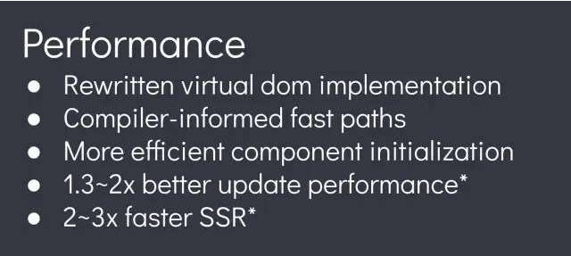

# 效率提升

## Vue3 的效率提升 {#vue3-efficiency}

`Vue3`客户端渲染效率比`Vue2`提升了 1.3 ~ 2 倍
SSR 渲染效率比 `Vue2` 提升了 2 ~ 3 倍



## Vue3 的效率提升主要表现在哪些方面？ {#vue3-efficiency-mainly}

- 静态提升
- 预字符串化
- 缓存事件处理函数
- Block Tree
- PatchFlag  

[Vue3 官网描述](https://cn.vuejs.org/guide/extras/rendering-mechanism.html#compiler-informed-virtual-dom)

## 静态提升 {#static-promotion}

:::info 静态提升
在 `Vue2` 中，每次渲染会重新创建 `VNode` 节点，即使是静态节点也会被重新创建。这会造成一些不必要的性能损耗。

而在 `Vue3` 中，引入了 `静态提升` 的概念，将静态节点在编译阶段提升为常量，避免了重复创建的开销。
:::

`Vue3` 中，模板编译成 `render` 函数后，可以发现哪些节点是 `静态节点`（纯 Dom 元素：不是组件，没有绑定任何动态属性），发现后会对这类节点**进行提升**（不在render函数中进行创建，而是在render外，这样每次执行 render 时就会减少工作量）。

模板：

```html
<h1>Hello World</h1>
```

Vue2编译后：

```js
render() {
  return createVNode('h1', null, 'Hello World')
}
```

Vue3编译后：

```js
const histed = createVNode('h1', null, 'Hello World')
function render() {
  // 这里可以直接使用 hissted 来渲染
}
```

此外 `静态属性` 也会被提升。

模板：

```html
<!-- 其中 class="user" 是静态属性 -->
<div class="user">
  {{ user.name }}
</div>
```

Vue3编译后：

```js
const hoisted = { class: 'user' }
function render() {
  createVNode('div', hoisted, [])
}
```


## 预字符串化 {#pre-stringify }

预字符串化（Pre-stringification）是一种优化技术，用于处理大量静态内容。它可以将静态内容在编译时转换为字符串，以减少运行时的计算和处理。

这在SSR中作用十分明显，组件中大多数东西都是静态元素，只有少数是动态的，如以下代码有大量连续的静态内容：

```html
<div class="menu-bar-container">
  <ul class="menu-bar">
    <li>新闻</li>
    <li>hao123</li>
    <li>地图</li>
    <li>贴吧</li>
    <li>视频</li>
    <li>图片</li>
    <li>网盘</li>
    <li>更多</li>
  </ul>

  <div class="user">
    <span>{{ user.name }}</span>
  </div>
</div>
```

当编译器遇到大量连续的静态内容（如：menu-bar），会直接将其编译为一个普通字符串节点

```js
const _hoisted_2 = _createStaticVNode("<ul class=\"menu-bar\"><li>新闻</li><li>hao123</li><li>地图</li><li>贴吧</li><li>视频</li><li>图片</li><li>网盘</li><li>更多</li></ul>")
```

## 缓存事件处理函数 {#cache-event-handler}

`Vue3` 会对时间处理函数进行缓存，`render` 中判断缓存 `cache` 中是否有这个事件，如果则进行复用，没有则向 `cache` 中添加此事件。

通过缓存事件处理函数，Vue3避免了在每次渲染时重新创建事件处理函数的开销，从而提高了渲染性能。

```js
<button @click="count++">click</button>
```

编译后：

```js
// Vue2
render(ctx) {
  return createVNode('button', {
    onClick: function($event) {
      ctx.count++;
    }
  })
}

// Vue3
function render(ctx, cache) {
  return createVNode('button', {
    onClick: cache[0] || (cache[0] = (e) => ctx.count++)
  })
}
```

## Block Tree {#block-tree}

`Vue2` 在对比新旧树时，并不知道哪些节点是静态的，哪些是动态的，因此只能一层层的比较，这就浪费了大部分的时间对比静态节点。

而 `Block Tree` 解决了新旧两颗树在对比时的效率

他会在根节点中记录后代的节点哪些是动态的，在对比时直接找到根节点，从根节点中去除记录动态节点的数组，对数组进行循环比较。

因为不涉及树中所有节点，因此节省了很多时间。

## PatchFlag {#patch-flag}

尽管通过以上 Vue3 已经跳过了几乎不需要对比的节点，Vue3 还添加了进一步的优化。

Vue2 在对比每一个节点时，并不知道这个节点哪些信息会发生变化，因此之恶能将所有信息以词对比，而在 Vue3 中它向虚拟 DOM 中添加了一个用于描述节点中可能发生变化的信息标记 `PatchFlg`。

```js

createVNode('span', null, _toDisplayString(_ctx.user.name), 1 /* TEXT */)
// 其中最后一个参数 1 表示在 span 中 text 的内容时动态的
// 这时在比较 span 元素时不需要关注其他，秩序要对比 text 的内容即可
```

