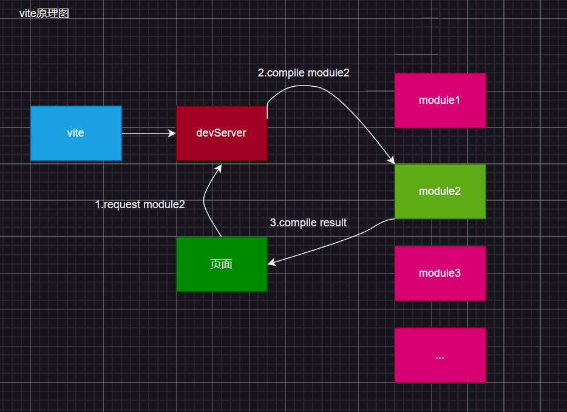

# 从 Webpack 到 Vite

## Webpack

开发环境使用 `webpack` 启动项目时，模块会在 `webpack` 中进行打包，最终打包成 `bundle`，随后返回一个开发环境路径

### 这样有两个缺点

- 1.当前项目较大时，依赖的包和第三方会很多，这样打包的速度会非常慢（可以在 network 处观察请求数量印证）。
- 2.热替换十分繁琐，当改动一个模块后相关模块也需要重新打包，重新打包后发送到 `devServer` 服务器。

## Vite

`Vite` 没有打包过程，直接启动开发服务器 `devServer`，它使用 `koa` 直接启动因此速度非常快

即便项目使用的包和第三方库很多，但由于 `Vite` 没有打包过程而是直接启动服务器，因此它还是会很快启动；

当访问页面时会直接返回 `index.html` 文件，而这个文件中入口 `js` 使用的是 `module` 的方式引入的，因此这个入口js不需要被编译；

在使用其他模块时，使用哪个编译哪个，编译后返回页面；

在编译 `.vue` 文件时，会将文件内容编译成纯 `js`，这得益于包：`@vue/compiler-sfc` 单文件组件编译器；

总结：

> vite 之所以快，是因为它没有打包的过程，只有编译，开发服务器在用到哪个模块后才会编译哪个模块

## Vite 和 Webpack 的对比

`webpack` 会先打包，然后启动开发服务器，请求服务器时直接给予打包结果。

而 `vite` 是直接启动开发服务器，请求哪个模块再对该模块进行实时编译。

由于现代浏览器本身就支持 `ES Module`，会自动向依赖的 `Module` 发出请求。`vite` 充分利用这一点，将开发环境下的模块文件，就作为浏览器要执行的文件，而不是像 `webpack` 那样进行打包合并。

由于 `vite` 在启动时不需要打包，也就意味着不需要分析模块依赖、不需要编译，因此启动速度非常快。

当浏览器请求某个模块时，再根据需要对模块内容进行编译。这种按需动态编译的方式，极大的缩减了编译时间，项目越复杂，模块越多，`vite` 的优势越明显。

在 `HMR（热替换）` 方面，当改动一个模块后，仅需要让浏览器重新请求该模块即可，不像 `webpack` 那样需要把该模块的相关依赖模块全部编译一次，效率更高。

当需要打包到生产环境时，`vite` 使用传统的 `rollup` 进行打包，因此，`vite` 的主要优势是在开发阶段。另外，由于vite利用的是 `ES Module` ，因此代码中不可以使用 `CommonJS`。