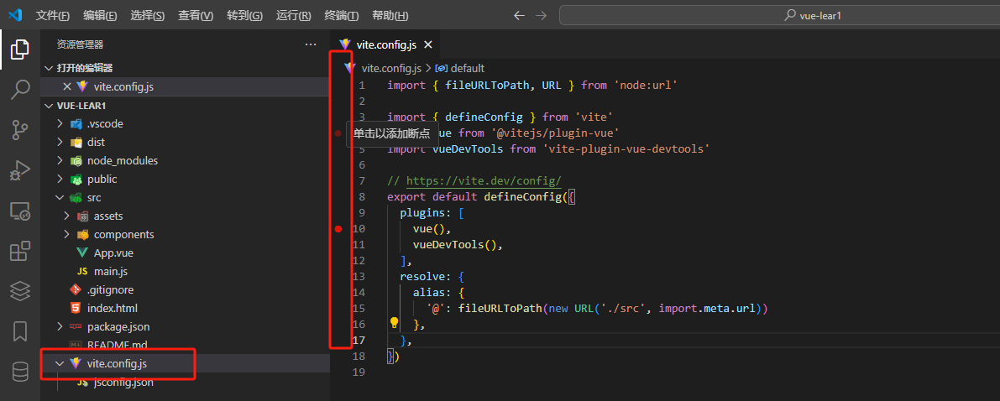
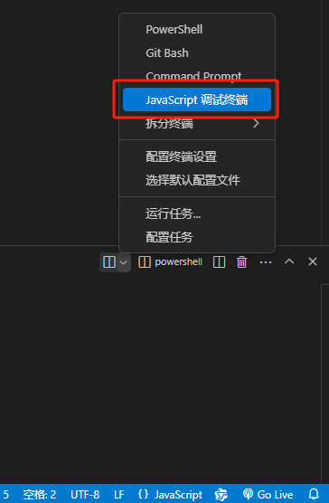
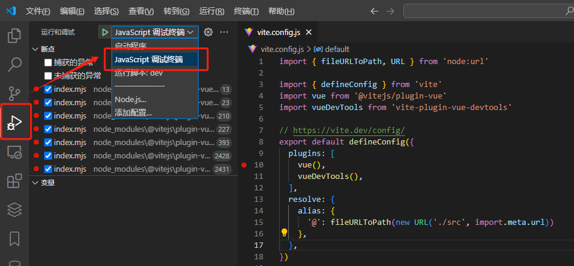
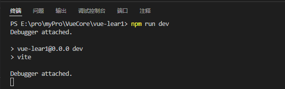

# Vue 文件编译

## 前言

参考[Vue3 编译原理揭秘](https://vue-compiler.iamouyang.cn/)。

因为浏览器无法直接使用 `Vue` 文件，所以需要编译为 `JavaScript` 文件。

在 `Webpack` 中，是通过 `vue-loader` 插件实现。而在 `Vite` 中，则是通过 `@vitejs/plugin-vue` 插件实现。

:::info 编译时的入口文件
在 `Vue3` 项目进行编译时，入口文件是 `vite.config.ts`，在这个文件中会引入 `@vitejs/plugin-vue`，并执行方法 `vuePlugin`。

当用户打开画面时，会从 `src/main.ts` 开始加载，没个被加载的文件会调用 `vuePlugin` 中的 `transform` 方法。
:::

## 调试源码

在了解 `Vue` 文件编译时，需要深入查看源码。

可以在 VsCode 中进行 `Debug`，来了解程序执行的过程。

- 1.新建项目，可在 `vite.config.ts` 文件的行号前单击添加断点。



- 2.添加 JavaScript调试终端



- 3.在右侧调试栏目下选择 JavaScript调试终端



- 4.在终端输入 `npm run dev` 运行项目（这时会自动跳转到断点上）



图中是 `vite.config.ts` 调用的 `@vitejs/plugin-vue` 中用来初始化的方法 `vuePlugin`。


## vuePlugin

`vuePlugin` 是 `@vitejs/plugin-vue` 中一个重要的方法，他会在初始阶段获取用于将 .vue 文件转换为 .js 文件的方法。

并在画面加载文件时进行检查（检查是否是 .vue 文件）和转换（将 .vue 文件转换为 .js 文件）。

这里只介绍几个主要的函数和它要做的事情，因此会将原代码进行简化，只提取必要部分。

```ts
function vuePlugin(rawOptions = {}) {
  const options = shallowRef({
    compiler: null,
    // ...
  })

  return {
    name: "vite:vue",
    // ...,
    buildStart() {
      // ...
    },
    // ...,
    transform() {
      // ...
    }
  }
}

```

在 `vuePlugin` 方法中，最终会返回一个对象，对象中 `buildStart`、`transform` 是重要的钩子函数。

- `buildStart` 在服务器启动时调用

- `transform` 在对文件进行解析时调用

### buildStart

`buildStart` 在服务器启动时调用，它的主要作用是获取编译 `.vue文件` 所用的各种方法，即为 `option.value.compiler` 赋值。

在 `vuePlugin` 的最开始我们可以看到，`option.value.compiler` 最初为 null，因此需要在服务器启动的最开始进行赋值。

以下为简化后的 `buildStart` 函数。

```ts
  const compiler = options.value.compiler = options.value.compiler || resolveCompiler(options.value.root);
```

代码中会判断 `options.value.compiler` 是否有值，如果有则继续使用寄存的 `options.value.compiler`，如果没有则调用 `resolveCompiler` 方法，并用结果为 `options.value.compiler` 赋值。

那么 `resolveCompiler` 是如何获取编译 `.vue文件` 所用的各种方法的呢？这些方法又存在哪里呢？

我们可以继续沿着 `resolveCompiler` 向下，以下是简化后的代码。

```ts
function resolveCompiler(root) {
  const compiler = tryResolveCompiler(root) || tryResolveCompiler();
}

function tryResolveCompiler() {
  // 获取项目使用的 Vue 的 package.json 文件
  const vueMeta = tryRequire("vue/package.json", root);
  // 判断使用的是否是 Vue3 以上版本
  if (vueMeta && vueMeta.version.split(".")[0] >= 3) {
    return tryRequire("vue/compiler-sfc", root);
  }
}
```

代码很简单，就是判断使用的 `Vue` 版本，如果是 `Vue3` 及以上版本就引入 `vue/compiler-sfc`，并将内容赋值给 `options.value.compiler`。

也就是说我们要使用的编译 `.vue文件` 的方法来自于 `vue/compiler-sfc`。


