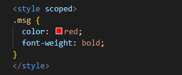

# Vue 文件编译

## 前言

参考[Vue3 编译原理揭秘](https://vue-compiler.iamouyang.cn/)。

因为浏览器无法直接使用 `Vue` 文件，所以需要编译为 `JavaScript` 文件。

在 `Webpack` 中，是通过 `vue-loader` 插件实现。而在 `Vite` 中，则是通过 `@vitejs/plugin-vue` 插件实现。

:::info 编译时的入口文件
在 `Vue3` 项目进行编译时，入口文件是 `vite.config.ts`，在这个文件中会引入 `@vitejs/plugin-vue`，并执行方法 `vuePlugin`。

当用户打开画面时，会从 `src/main.ts` 开始加载，没个被加载的文件会调用 `vuePlugin` 中的 `transform` 方法。
:::

## 调试源码

在了解 `Vue` 文件编译时，需要深入查看源码。

可以在 VsCode 中进行 `Debug`，来了解程序执行的过程。

- 1.新建项目，可在 `vite.config.ts` 文件的行号前单击添加断点。


- 2.添加 JavaScript调试终端


- 3.在右侧调试栏目下选择 JavaScript调试终端


- 4.在终端输入 `npm run dev` 运行项目（这时会自动跳转到断点上）


图中是 `vite.config.ts` 调用的 `@vitejs/plugin-vue` 中用来初始化的方法 `vuePlugin`。


## vuePlugin

`vuePlugin` 是 `@vitejs/plugin-vue` 中一个重要的方法，他会在初始阶段获取用于将 .vue 文件转换为 .js 文件的方法。

并在画面加载文件时进行检查（检查是否是 .vue 文件）和转换（将 .vue 文件转换为 .js 文件）。

这里只介绍几个主要的函数和它要做的事情，因此会将原代码进行简化，只提取必要部分。

```ts
function vuePlugin(rawOptions = {}) {
  const options = shallowRef({
    compiler: null,
    // ...
  })

  return {
    name: "vite:vue",
    // ...,
    buildStart() {
      // ...
    },
    // ...,
    transform() {
      // ...
    }
  }
}

```

在 `vuePlugin` 方法中，最终会返回一个对象，对象中 `buildStart`、`transform` 是重要的钩子函数。

- `buildStart` 在服务器启动时调用

- `transform` 在对文件进行解析时调用

## buildStart

`buildStart` 在服务器启动时调用，它的主要作用是获取编译 `.vue文件` 所用的各种方法，即为 `option.value.compiler` 赋值。

在 `vuePlugin` 的最开始我们可以看到，`option.value.compiler` 最初为 null，因此需要在服务器启动的最开始进行赋值。

以下为简化后的 `buildStart` 函数。

```ts
  const compiler = options.value.compiler = options.value.compiler || resolveCompiler(options.value.root);
```

代码中会判断 `options.value.compiler` 是否有值，如果有则继续使用寄存的 `options.value.compiler`，如果没有则调用 `resolveCompiler` 方法，并用结果为 `options.value.compiler` 赋值。

那么 `resolveCompiler` 是如何获取编译 `.vue文件` 所用的各种方法的呢？这些方法又存在哪里呢？

我们可以继续沿着 `resolveCompiler` 向下，以下是简化后的代码。

```ts
function resolveCompiler(root) {
  const compiler = tryResolveCompiler(root) || tryResolveCompiler();
}

function tryResolveCompiler() {
  // 获取项目使用的 Vue 的 package.json 文件
  const vueMeta = tryRequire("vue/package.json", root);
  // 判断使用的是否是 Vue3 以上版本
  if (vueMeta && vueMeta.version.split(".")[0] >= 3) {
    return tryRequire("vue/compiler-sfc", root);
  }
}
```

代码很简单，就是判断使用的 `Vue` 版本，如果是 `Vue3` 及以上版本就引入 `vue/compiler-sfc`，并将内容赋值给 `options.value.compiler`。

也就是说我们要使用的编译 `.vue文件` 的方法来自于 `vue/compiler-sfc`。

## transform

`transform` 方法会在每次对文件进行解析时调用。

当服务器启动时，在控制台中会显示一个路径，这个就不必多说了，当我们访问这个路径，会先访问运行时的入口文件 `src/main.ts`，这时就会触发钩子函数 `transform`。


以下是简化后的 `transform` 函数：

```ts
/**
 * id: 被导入文件路径（如：E:/xxx/project-name/src/test.vue?a=1?b=2）
 */
transform(code, id, opt) {
  // filename: 被导入的文件名（E:/xxx/project-name/src/test.vue?a=1?b=2 -》 E:/xxx/project-name/src/test.vue）
  // query: 文件路径后的参数（E:/xxx/project-name/src/test.vue?a=1?b=2 -》 {a: 1, b: 2}）
  const { filename, query } = parseVueRequest(id);

  // 判断是否有 vue 参数
  if (!query.vue) {
    return transformMain(...)
  } else {
    const descriptor = query.src ? getSrcDescriptor(filename, query) || getTempSrcDescriptor(filename, query) : getDescriptor(filename, options.value);
    // 判断是否为文件类型是否为 style
    if (query.type === "style") {
      return transformStyle(...)
    }
  }
}
```

主要判断要解析的文件是否为 `.vue` 文件（如：App.vue），如果是则调用 `transformMain` 方法，否则则可能是样式文件，调用 `transformStyle` 方法。

## transformMain

在解析 `App.vue` 文件时，我们可以根据断点进入 `transformMain`。这个方法主要做了几件事情。

- 1.根据文件中的代码字符串调用 `createDescript` 函数，生成一个 `descriptor` 对象（其实就是将代码字符串拆解，按照script、template、style进行分类方便之后的步骤使用）
- 2.调用 `genScriptCode` 函数，将 `descriptor` 当作参数传入，将原代码的 `<script setup>` 部分编译为浏览器可执行的 js 代码。
- 3.调用 `genTemplateCode` 函数，将 `descriptor` 当作参数传入，将原代码的 `template` 部分编译为 `render` 函数
- 4.调用 `genStyleCode` 函数，将 `descriptor` 当作参数传入，将原代码的 `<style scoped>` 部分编译为 **导入** 语句。**注意** 这里不是编译成可执行的css语句，而是 `import "/src/App.vue?vue&type=style&index=0&scoped=7a7a37b1&lang.css"` 这种的 import 语句，因为导入语句在导入文件时会再次触发 `transform` 这样就会顺利成章的走入 `transformStyle` 的部分了

```ts
async function transformMain(code, filename, options, ...) {
  // 格式化代码字符串，拆解成 descriptor 对象
  const { descriptor, errors } = createDescriptor(filename, code, options)

  // 根据 descriptor 对象的对应部分编译生成浏览器可执行代码
  const { scriptCode } = await genScriptCode(descriptor, ...)
  const { templateCode } = await genTemplateCode(descriptor, ...)
  const { styleCode } = await genStyleCode(descriptor, ...)

  // 将 script、template、style 部分放在一个数组中
  const output = [
    scriptCode,
    templateCode,
    styleCode
  ]
  // 合并 script、template、style 部分代码，并以结束符号分割
  let resolvedCode = output.join('\n')

  // 返回 编译 并 合并 后的代码
  return {
    code: resolvedCode,
    ...
  }
}
```

#### createDescriptor

`createDescriptor` 函数主要是将代码字符串拆解成 `descriptor` 对象，这个对象中包含 `script`、`template`、`style` 等部分。

它需要用到的两个主要参数时 `filename` （文件路径名） 和 `source` （文件内源代码），另外 `options` 是一些配置参数，要转化成 `descriptor` 需要用到 `options.value.compiler`，还记得吗，这个就是从 `vue/compiler-sfc`导入的。

以下是简化后的代码

```ts
function createDescriptor(filename, source, {
  root,
  compiler, // vue/compiler-sfc
  ...
}) {
  // 将 source 编译成 descriptor 对象
  const { descriptor } = compiler.parse(source, { filename, ... })

  // 生成文件的 id 标识
  const normalizedPath = normalizePath$1(path.relative(root, filename));
  descriptor.id = getHash(normalizedPath + (isProduction ? source : ""));

  return { descriptor, ... };
}
```

编译 `descriptor` 对象使用了 `vue/compiler-sfc` 中暴露出来的函数 `parse`，这是我们遇到的第一个 Vue3 底层 API，在进入源码后，我们可以找到 `parse` 的定义，以及他的 **参数（SFCParseResult）** 和 **返回值（SFCParseResult）**，通过返回值我们还可以找到 `descriptor` 的接口定义 `SFCDescriptor`。

```ts
export declare function parse(source: string, options?: SFCParseOptions): SFCParseResult;

export interface SFCParseOptions {
    filename?: string;
    sourceMap?: boolean;
    sourceRoot?: string;
    pad?: boolean | 'line' | 'space';
    ignoreEmpty?: boolean;
    compiler?: TemplateCompiler;
    templateParseOptions?: ParserOptions;
}

export interface SFCParseResult {
    descriptor: SFCDescriptor;
    errors: (CompilerError | SyntaxError)[];
}

export interface SFCDescriptor {
    filename: string;
    source: string;
    template: SFCTemplateBlock | null;
    script: SFCScriptBlock | null;
    scriptSetup: SFCScriptBlock | null;
    styles: SFCStyleBlock[];
    customBlocks: SFCBlock[];
    cssVars: string[];
    slotted: boolean;
    shouldForceReload: (prevImports: Record<string, ImportBinding>) => boolean;
}
```

在 `SFCDescriptor` 中，我们的重点关注对象有三个：

- scriptSetup.content -> script setup 脚本代码
- template.content -> template 模板代码
- styles.content -> style 样式代码


**流程图**


#### genScriptCode

`genScriptCode` 函数主要是将 `descriptor` 当作参数传入，将原代码的 `<script setup>` 部分编译为浏览器可执行的 js 代码。

```ts
function genScriptCode(descriptor, ...) {
  // scriptIdentifier 是在全局定义的一个常量值 `_sfc_main`, 这句话相当于 const _sfc_main = {}
  let scriptCode = `const ${scriptIdentifier} = {}`
  // 这里调用 resolveScript 函数用于执行编译
  const script = resolveScript(descriptor, options, ssr, customElement)
  if (script) {
    // 将编译后的代码赋值给 scriptCode
    scriptCode = script.content
    map = script.map
  }
  return { scriptCode, map }
}

/** 用于对 <script setup> 脚本代码进行编译 */
function resolveScript(descriptor, options, ssr, customElement) : SFCScriptBlock {
  let resolved = null
  // 使用 vue/compiler-sfc 的 compileScript 函数进行编译
  resolved = options.compiler.compileScript(descriptor, ...)
  return resolved
}

```

`SFCScriptBlock` 接口定义:

```ts
export interface SFCScriptBlock extends SFCBlock {
  type: 'script'
  setup?: string | boolean
  bindings?: BindingMetadata
  imports?: Record<string, ImportBinding>
  scriptAst?: import('@babel/types').Statement[]
  scriptSetupAst?: import('@babel/types').Statement[]
  warnings?: string[]
  deps?: string[]
}

export interface SFCBlock {
  type: string
  content: string // 编译后的 js 代码
  attrs: Record<string, string | true>
  loc: SourceLocation
  map?: RawSourceMap
  lang?: string
  src?: string
}

```

`scriptCode` 的值（`SFCBlock.content`）：


原代码：

```ts
import { ref } from "vue";

const msg = ref("hello word");
```

`genScriptCode` 执行流程图：


#### genTemplateCode

`genTemplateCode` 函数主要是将 `descriptor` 当作参数传入，将原代码的 `<template>` 部分编译为浏览器可执行的 js 代码。

```ts
async function genTemplateCode(descriptor, ...) {
  const template = descript.template
  // template.content 就是 App.vue 中 template 标签内的代码，注意是标签内代码，不涵盖 template 标签
  return transformTemplateInMain(template.content, ...)
}

function transformTemplate(code, ...) {
  const result = compile(code, ...)

  return {
    ...result,
    code: result.code.replace(
      /\nexport (function|const) (render|ssrRender)/,
      "\n$1 _sfc_$2"
    )
  }
}

function compile(code, ...) : SFCTemplateCompileResults {
  const result = options.compiler.compileTemplate({
    ...,
    source: code
  })
  return result
}
```

代码流程如上，`genTemplateCode` 先会调用 `transformTemplate` 函数，再由 `transformTemplate` 函数调用 `compile` 函数进行编译。

`compile` 函数中，编译通样使用了 `vue/compiler-sfc` 中的函数，只不过这次由于编译的是 `template` 因此使用的是 `compileTemplate` 函数，返回值也变成了 `SFCTemplateCompileResults`。

`SFCTemplateCompileResults` 接口定义:

```ts
export interface SFCTemplateCompileResults {
    code: string; // 编译后的 js 代码
    ast?: RootNode; // AST抽象语法树
    preamble?: string;
    source: string; // 原代码
    tips: string[];
    errors: (string | CompilerError)[];
    map?: RawSourceMap;
}
```

`SFCTemplateCompileResults.code` :


原代码：

```html
<h1 class="msg" data-v-inspector="src/App.vue:8:3">{{ msg }}</h1>
```

`genTemplateCode` 执行流程图：


#### genStyleCode

`genStyleCode` 函数主要是将 `descriptor` 当作参数传入，将原代码的 `<style>` 部分编译为 **导入（import）** 语句。

```ts
async function genStyleCode(descriptor, ...) {
  let styleCode = ``;

  // 因为可能有多个 <script> 标签，因此需要循环遍历
  if (descriptor.styles.length) {
    const style = descriptor.styles[i];
    const src = style.src || descriptor.filename;
    const attrsQuery = attrsToQuery(style.attrs, "css");
    const srcQuery = style.src ? style.scoped ? `&src=${descriptor.id}` : "&src=true" : "";
    const directQuery = customElement ? `&inline` : ``;
    const scopedQuery = style.scoped ? `&scoped=${descriptor.id}` : ``;
    const query = `?vue&type=style&index=${i}${srcQuery}${directQuery}${scopedQuery}`;
    const styleRequest = src + query + attrsQuery;

    // 制作导入语句，换行是为了和其他 import 分隔开
    stylesCode += `
      import ${JSON.stringify(styleRequest)}`
  }

  return styleCode
}
```
我们发现这里没有调用 `vue/compiler-sfc`，因为 `style` 真正的编译将在 `transformStyle` 函数中完成。此处只是制作导入语句，当导入语句被执行时会导入文件会触发 `transform` 函数，并在对文件类型判断后进入 `transformStyle` 函数。

以下时 `App.vue` 的 `script` 被编译后，通过打印可以发现已经转换成了 **import** 语句。并且路径是当前 `App.vue`，只是后面多了几个 `query`，分别是：`vue`、`type`、`index`、`scoped`、`lang`。


还记得这段代码吗？ `transform` 会判断 `query` 中 是否带有 `vue` 参数，如果没有有 `vue` 参数，则进入 `transformMain` 函数。

如果 `query` 中有 `vue` 参数，且 `query.type` 为 `style`，则进入 `transformStyle` 函数。

```ts
transform(code, id, opt) {
  const { filename, query } = parseVueRequest(id);
  if (!query.vue) {
    // ...
  } else {
    const descriptor = query.src ? getSrcDescriptor(filename, query) || getTempSrcDescriptor(filename, query) : getDescriptor(filename, options.value);
    if (query.type === "style") {
      return transformStyle(...);
    }
  }
}
```

`genStyleCode` 流程图：


## transformStyle

`transformStyle` 函数的作用是编译导入的 `style` 文件。

以刚刚的`App.vue`为例，经过 `genStyleCode` 函数后，`styleCode` 的值为：

```ts
import "E:/pro/myPro/VueCore/vue-lear1/src/App.vue?vue&type=style&index=0&scoped=7a7a37b1&lang.css"
```

在文件导入时会触发 `transform`，经过 `query` 的判断后不出意外的执行 `transformStyle` 函数。


```ts
async function transformStyle(code, descriptor, ...) {
  const block = descriptor.styles[index];
  const result = await options.compiler.compileStyleAsync({
    source: code, // 原代码
    scoped: block.scoped, // 是否带有 scoped
    id: `data-v-${descriptor.id}`, // scoped 作用域id
    ...
  })

  return {
    code: result.code,
    ...
  }
}
```

`compileStyleAsync` 的返回值类型：

```ts
export interface SFCStyleCompileResults {
    code: string; // 编译后的 css 代码
    map: RawSourceMap | undefined;
    rawResult: Result | LazyResult | undefined;
    errors: Error[];
    modules?: Record<string, string>;
    dependencies: Set<string>;
}
```

`SFCStyleCompileResults.code` 的值：


原代码：



## 总结

拆分来看 `Vue` 文件编译成 `JS` 的过程十分简单，每当 `Vite` 加载模块时，就会触发 `fransform` 函数。

`fransform` 将 `Vue` 文件的 `script setup`、`template`、`style` 部分拆分并生成了 `descriptor` 对象。

之后分别针对它们调用 `fransformMain` 中的 `genScriptCode`、`genTemplateCode`、`genStyleCode` 函数，编译生成 `JS` 代码。

- `genScriptCode`：编译 `script setup` 部分，生成 `JS` 代码
  - ⬆使用 `vue/compiler-sfc` 中的 `compileScript` 函数
- `genTemplateCode`：编译 `template` 部分，生成 `render` 方法
  - ⬆使用 `vue/compiler-sfc` 中的 `compileTemplate` 函数
- `genStyleCode`：编译 `style` 部分，生成 `import` 语句

在编译后进行组合也就完成了 `Vue` 到 `JS` 的转换。

在之后当浏览器执行到 `import "E:/pro/myPro/VueCore/vue-lear1/src/App.vue?vue&type=style&index=0&scoped=7a7a37b1&lang.css"` 时，再次触发了模块加载，进入 `transform` 钩子函数，此时由于 `import` 语句的 `url` 中带有 `vue` 参数和 `type=style`，因此会执行 `transformStyle` 函数。

在 `transformStyle` 中，使用了 `vue/compiler-sfc` 中的 `compileStyleAsync` 函数，将 `style` 部分编译为 `css` 代码。

