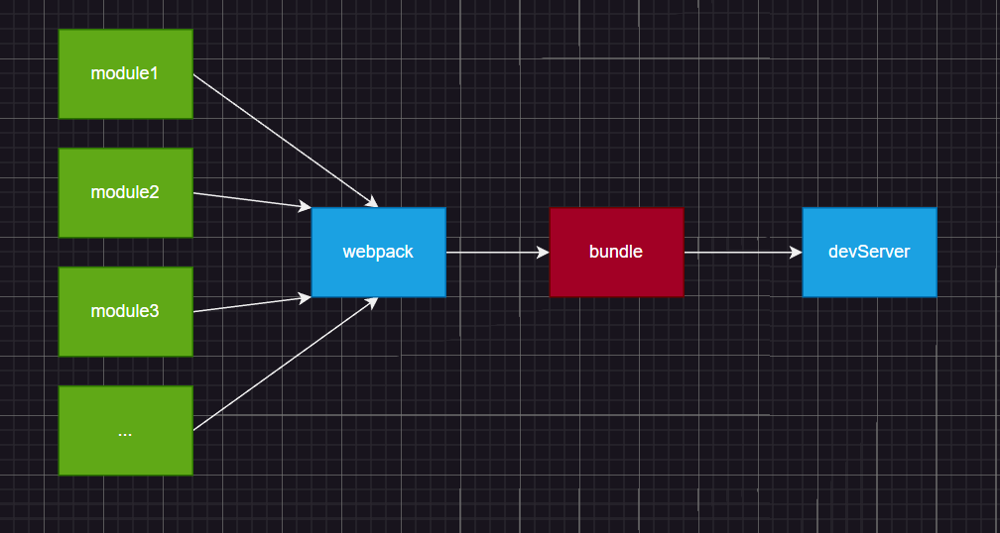
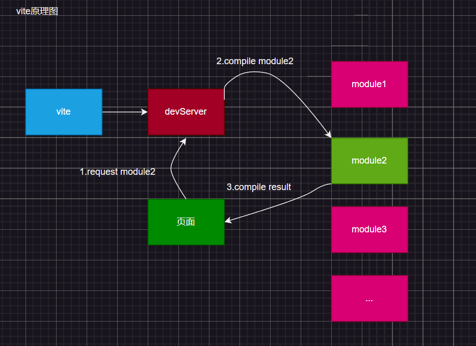

# 与webpack对比

## webpack原理图

> 模块在webpack进行打包形成最终打包后的结果bundle，随后返回一个开发环境的路径

缺点：
- 1.当项目比较大时依赖，依赖的包和第三方库会非常多，这样打包的速度会非常的面
- 2.热替换十分繁琐，当改动一个模块后相关模块也需要重新打包，将重新打完的包发送到devServer服务器

## vite原理
> vite没有打包过程，直接启动开发服务器devServer，它是用koa直接启动因此速度非常快

- 1.即便项目使用的包和第三方库很多，但由于vite没有打包过程而是直接启动服务器，因此它还是会很快启动
- 2.当访问页面时会直接返回index.html文件，而在这个文件中入口js使用的是module的方式引入，因此这个入口js文件不需要被编译
- 3.在使用到其他模块时，使用到那个编译那个，编译后返回页面
- 4.在编译.vue文件时会将文件内容编译成纯js，这得益于包：【@vue/compiler-sfc】单文件组件编译器

总结：

vite之所以快是应为他没有打包过程只有编译，开发服务器在用到那个模块后才会编译那个模块

## vite & webpack

webpack会先打包，然后启动开发服务器，请求服务器时直接给予打包结果。

而vite是直接启动开发服务器，请求那个模块再对该模块进行实时编译。

由于现代浏览器本身就支持ES Module，会自动向依赖的Module发出请求。vite充分利用这一点，将开发环境下的模块文件，就作为浏览器要执行的文件，而不是像webpack那样进行打包合并。

由于vite在启动时不需要打包，也就意味着不需要分析模块依赖、不需要编译，因此启动速度非常快。

当浏览器请求某个模块时，再根据需要对模块内容进行编译。这种按需动态编译的方式，极大的缩减了编译时间，项目越复杂，模块越多，vite的优势越明显。

在HMR（热替换）方面，当改动一个模块后，仅需要让浏览器重新请求该模块即可，不像webpack那样需要把该模块的相关依赖模块全部编译一次，效率更高。

当需要打包到生产环境时，vite使用传统的rollup进行打包，因此，vite的主要优势是在开发阶段。另外，由于vite利用的是ES Module，因此代码中不可以使用CommonJS
