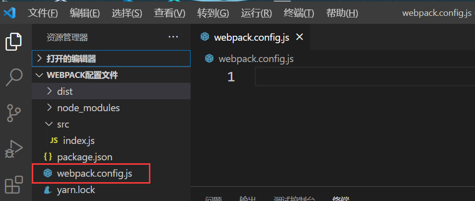

# 配置文件

webpack 提供了许多参数，我们可以直接使用命令行来调用。

但为了 **更加灵活、方便** 的使用webpack，我们还可以引入 **配置文件**。

**注意：** 如果 **配置文件** 和 **命令行** 发生了冲突，那么 **以命令行为准**

## webpack配置文件写在哪里？

一般来说webpack的配置文件要放在根目录下，是一个js代码文件，命名为webpack.config.js。

这个文件名是可以改的但需要做一些配置（可以用命令行的--config来指定配置文件）

## webpack配置文件中写什么？

只要最终可以通过CommonJS模块导出一个对象，对象中的各种属性对应不同的webpack配置即可。

**注意：** 只能是通过CommonJS导出，在这里es6的导出方式会报错，这是由于配置文件是在打包的过程中进行读取的，而打包的过程只能在node环境中进行，这时要由node读取配置文件中的内容。

## webpack基本配置
