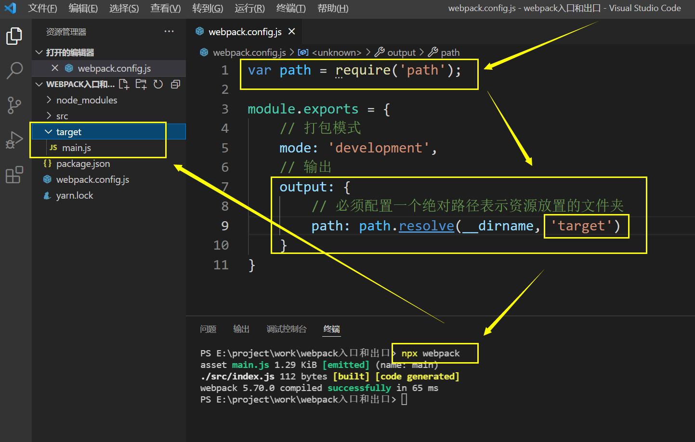
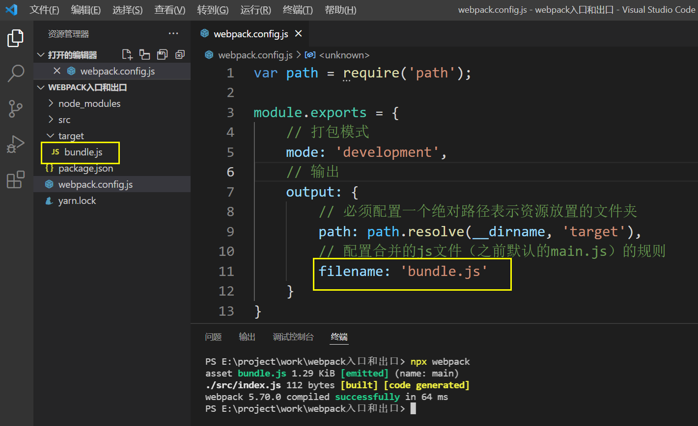
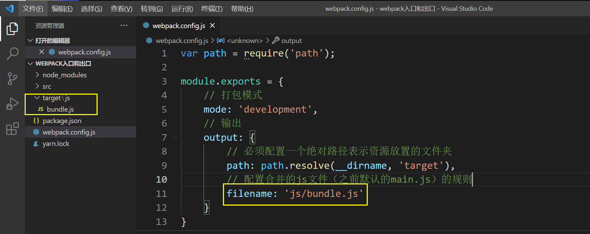
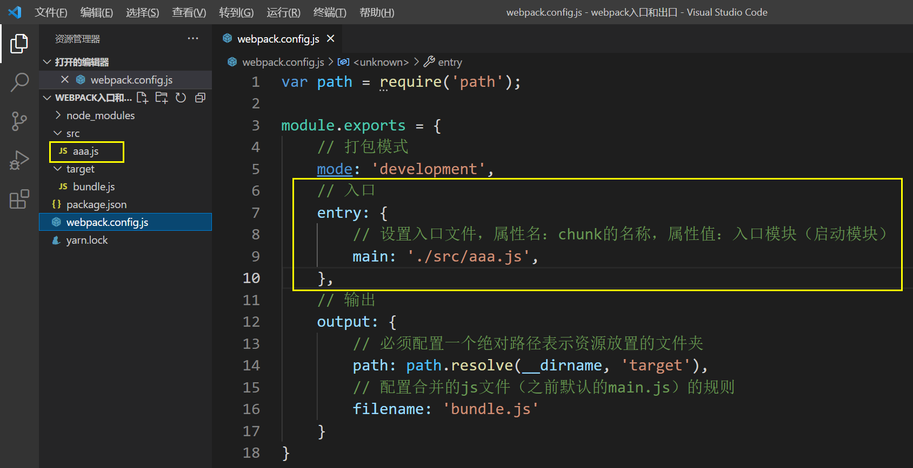
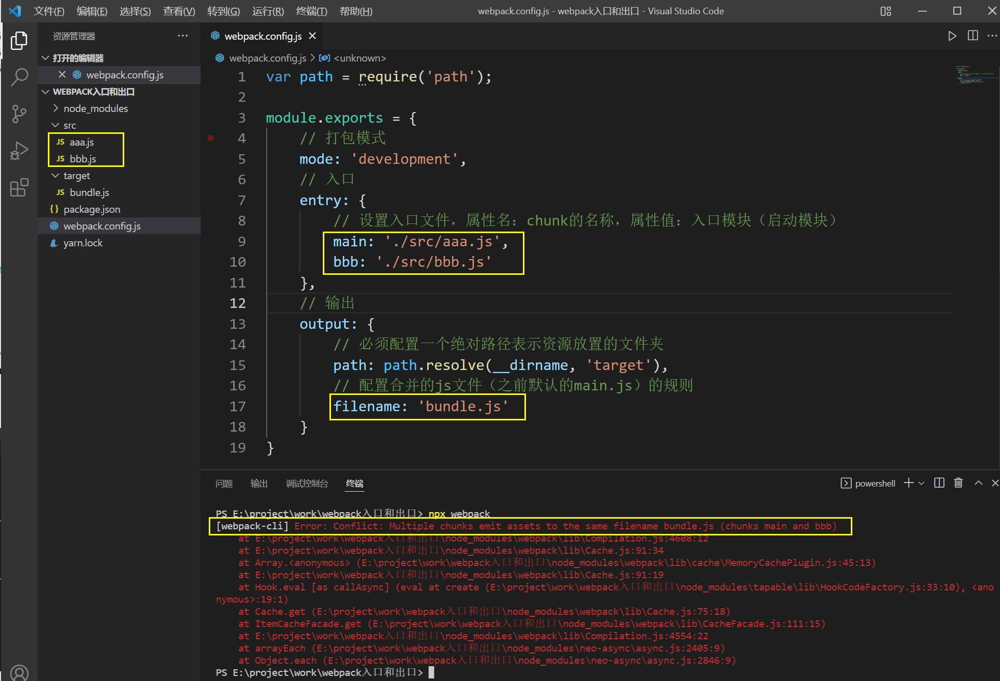
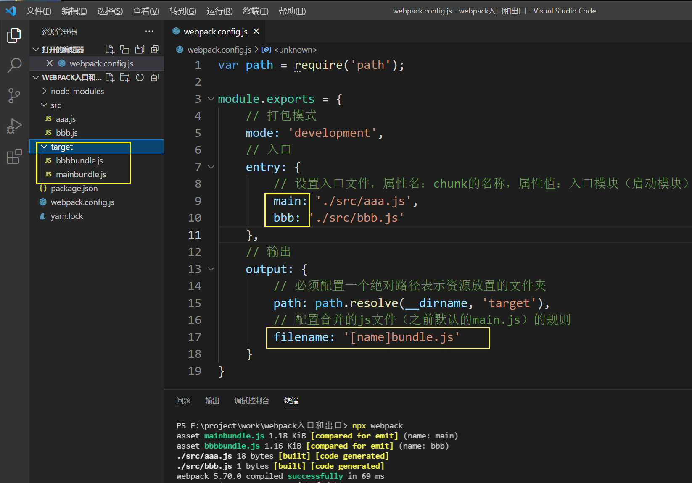
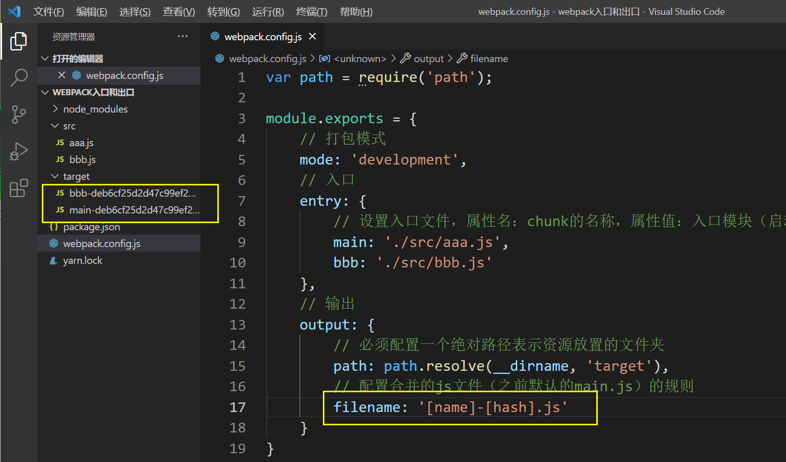

# 入口和出口

## Node 环境下的路径符号

- `./`：在配置文件中，`./`表示 node 运行目录。
- `__dirname`：在所有情况下，都表示当前运行的js所在的目录

## 出口

这里的出口是针对**资源列表**的 **文件名或路径** 的配置

出口通过 **output** 进行配置，一般常用的又两个属性 **path、filename**

### output.path

output.path 是一个绝对路径，表示存放输出资源的文件夹，一般使用 `path.resolve(__dirname, 'dist')` 来生成路径

### output.filename

output.filename 是一个字符串，表示输出资源的文件名。

当然也不只能设定文件，文件夹+文件也可以。

## 入口

这里的入口指的其实就是chunk。

入口可以有多个，但如果直接设置了多个入口，这时由于出口只有一个会报错 `Error: Conflict: Multiple chunks emit assets to the same filename bundle.js (chunks main and bbb)` 上描的bundle和bbb皆为配置名。

为了解决这个问题，需要给出口的 `output.filename` 设置规则，用以输出多个文件。

规则需要写在 `[]` 中

- `[name]`：打包时会将入口的 chunk 名替换掉 `[name]`

- [hash]：将文件通过 hash 算法生成的字符串替换 `[hash]`，这可以有效的而防止浏览器缓存带来的问题，因为以但文件内容改变 hash 也跟着改变，这时浏览器就会重新从服务器拉取文件。

- [chunkhash]：同时hash，只不过这个是把 chunk 的 hash 当作文件名。
