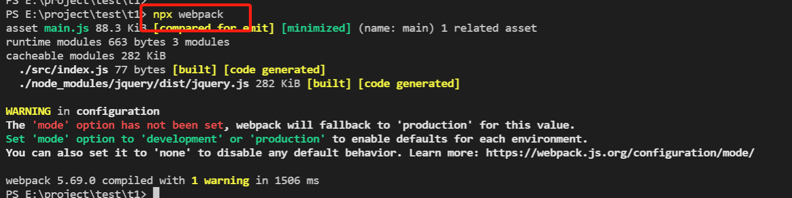

# 安装

webpack是 基于模块化的打包工具

## 特点

**为前端工程化而生**：webpack致力于解决前端工程化，特别是浏览器端工程化中遇到的问题，让开发者集中注意力编写业务代码，而把工程化过程中的问题全部交给webpack来处理

**简单易用**：支持零配置，可以不用写任何一行额外的代码就使用webpack

**生态强大**：webpack是非常灵活、可拓展的，webpack本身的功能并不多，但是它提供了一些可以扩展功能的机制，使得一些第三方库可以融于webpack中

**基于node.js**：由于webpack在构建的过程中需要读取文件，因此它是运行在node环境中的

**基于模块化**：webpack在构建过程中要分析依赖关系，方式是通过模块化导入语句进行分析，它支持各种模块化标准，包括但不限于CommonJS、ES6 Module

## 安装:

**webpack通过npm安装，它提供了两个包：**

- webpack：核心包，包含了webpack构建过程中要用到的所有api
- webpack-cli：提供一个简单的cli命令，它调用了webpack核心包的api，来完成构建过程

**安装方式：**

- 全局安装：可以使用webpack命令，但是无法为不同项目对应不同的webpack版本
- 本地安装：推荐，每个项目都使用自己的webpack版本进行构建

命令：

```bash
npm i -D webpack webpack-cli
```

> 安装webpack和webnpack-cli，-D表示是安装在开发环境，因为webpack不需要在生产环境部署。

## 使用

**webpack**：使用这个命令webpack在默认情况下会读取src下文件进行打包，打包后会在工程的根目录生成dist文件夹存放打包后的文件,可以将这段命令写入package.json中方便管理



**【'mode' option has not been set】？**

按照上面的方式打包，会出现这个红色字体，这是因为没有选择打包模式【开发模式/生产模式】,虽然出现了红色字体但是这时的打包依然是成功的，因为没有设置模式默认打出的包是生产模式。

- npx webpack --mode=development：开发模式打包
- npx webpack --mode=production：生产模式打包
