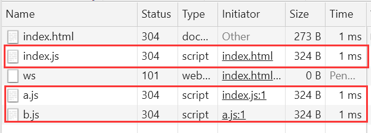
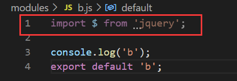
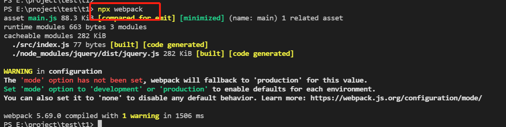

# Webpack

webpack 是一款基于模块化的打包工具，主要使用它来解决前端工程化、模块化产生的一些问题

## 模块化

在前端模块化的概念中，模块是可复用的代码片段，代码片段分布在各个文件中，在使用时如同拼积木一样进行组合，从而实现功能。

它可以让代码片段复用，避免全局污染，提高代码的可维护性、可读性，但同时也带来了一些问题。

**模块化特点：** 

- 避免全局作用域污染：如果所有代码都写在一个文件中，变量和函数容易冲突。
- 提高代码可维护性：拆分成小模块后，更易于维护和扩展。
- 提高代码复用性：一个模块可以在多个项目或文件中使用。
- 提升开发效率：多人协作时，每个开发者可以专注于自己负责的模块。

**模块化带来的一些问题：**

1.运行效率

精细的模块划分带来了更多的js文件，更多的Js文件带来了更多的请求，降低了页面访问效率。



2.兼容性

浏览器目前仅支持ES6模块化标准，只能使用ES6的导入导出，无法使用commonJs或AMD的导入导入导出方式，因此如果引入的包如果是以非ES6模式进行的导出，在浏览器是用不了的。

例如 JQuery，由于它不止可以在浏览器环境使用，因此它的导出方式使用的是commonJs，无法在浏览器中直接引入。


3.工具问题：浏览器在导入时，不支持获取npm下载的第三方包




如图中，文件中引入了 `jquery`，在没有其他工具的帮助下，浏览器只支持 import 以 `/`、`./`、`../` 开头，无法左到不加地址符自动匹配到`node_modules`。

**以上模块化所产生的问题，仅仅是前端工程化的一个缩影，实际上的问题要更多**

当开发一个具有规模的程序时，你将遇到许许多多非业务相关的问题，如：**执行效率、兼容性、代码可维护性、可拓展性、团队协作、测试** 等。

我们将这些问题称之为工程问题。工程问题与业务无关。它深刻的影响到开发进度，如果没有一个好的工具解决这些问题，将使得开发进度变得缓慢，同时也让开发人员陷入技术的泥潭。

### 为什么模块化的问题在node端没那么明显，而在浏览器端变得如此复杂

1.在node端，运行的JS文件载本地，因此可以本地读取，他的运行效率要比浏览器远程传输文件快得多。

2.在浏览器端，开发时态和运行时态的侧重点不同

### 工程开发的两个时机

1.开发时态（devtime）

- 模块划分越细越好
- 支持多模块化标准
- 支持npm或其他包管理器下载模块
- 能够解决其他工程化问题

2.运行时态（runtime）

- 文件越少越好
- 文件体积越小越好
- 代码不可读越好
- 所有浏览器都要兼容
- 能供解决其他运行时的问题，主要是执行效率

### 解决方案

既然开发时态和运行时态面临的局面有巨大的差异，因此，我们需要有一个工具，这个工具能够让开发者专心的在开发时态写代码，然后利用这个工具将开发时态编写的代码转换为运行时态需要的东西。

这样的工具，叫 **构建工具**。

> devtime --> 构建工具 --> runtime

这样以来，开发者就可以专注于开发时态的代码构建，而不用担心运行时态遇到的问题。

## Webpack 特点

- **为前端工程化而生**：webpack致力于解决前端工程化，特别是浏览器端工程化中遇到的问题，让开发者集中注意力编写业务代码，而把工程化过程中的问题全部交给webpack来处理
- **简单易用**：支持零配置，可以不用写任何一行额外的代码就使用webpack
- **生态强大**：webpack是非常灵活、可拓展的，webpack本身的功能并不多，但是它提供了一些可以扩展功能的机制，使得一些第三方库可以融于webpack中
- **基于node开发**：由于webpack在构建的过程中需要读取文件，因此它是运行在node环境中的
- **基于模块化**：webpack在构建过程中要分析依赖关系，方式是通过模块化导入语句进行分析，它支持各种模块化标准，包括但不限于CommonJS、ES6 Module

## Webpack 安装

webpack 通过npm安装，它提供了两个包

- webpack：核心包，包含了 webpack构建过程中要用到的所有api
- webpack-cli：提供了一个简单的cli命令，它调用了 webpack 核心包下的api，用来完成构建过程

```bash
npm i -D webpack webpack-cli
```

`npx webpack`

使用这个命令webpack在默认情况下会读取src下文件进行打包，打包后会在工程的根目录生成dist文件夹存放打包后的文件,可以将这段命令写入package.json中方便管理



**【'mode' option has not been set】？**

按照上面的方式打包，会出现这个红色字体，这是因为没有选择打包模式【开发模式/生产模式】,虽然出现了红色字体但是这时的打包依然是成功的，因为没有设置模式默认打出的包是生产模式。

**npx webpack --mode=development**：开发模式打包

**npx webpack --mode=production**：生产模式打包
