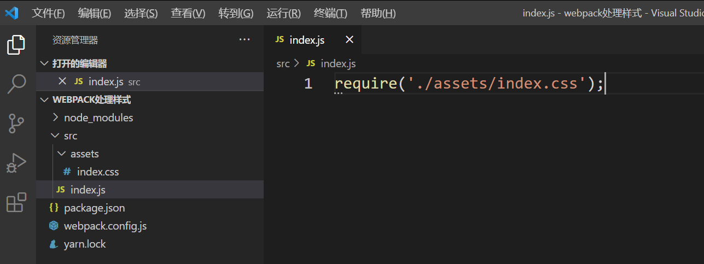
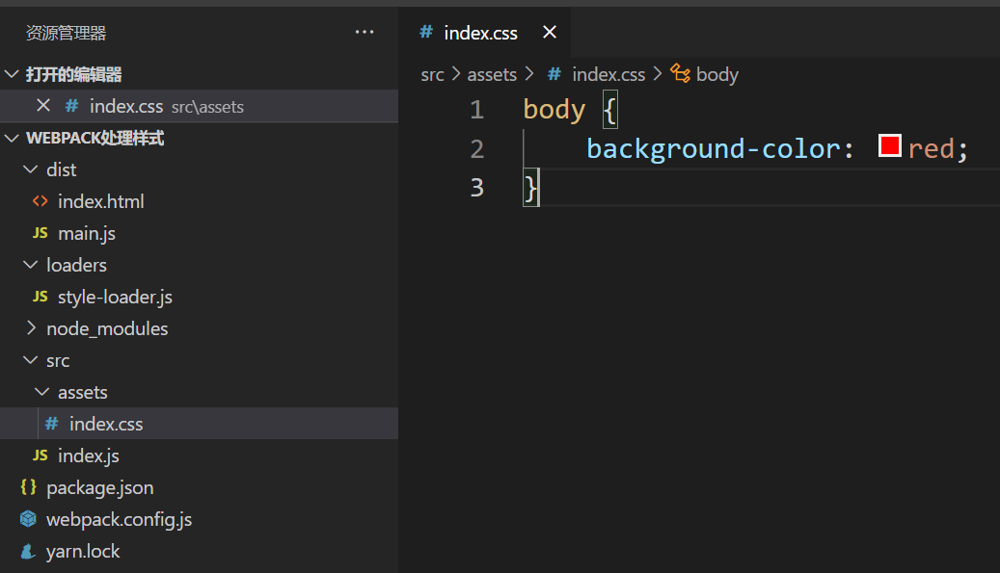
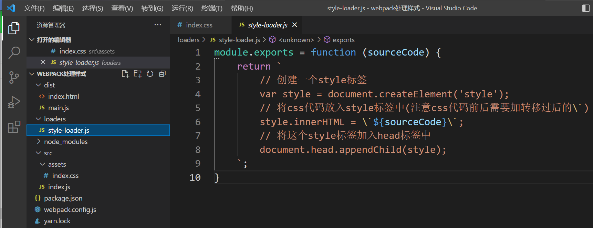
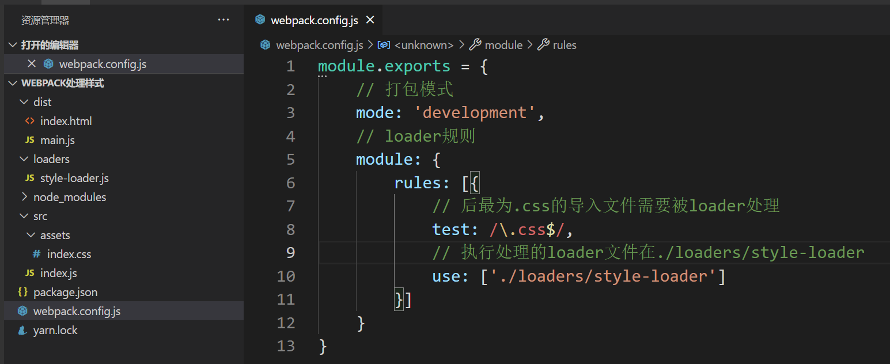
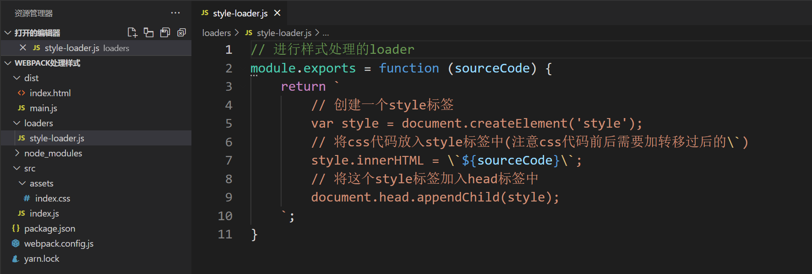
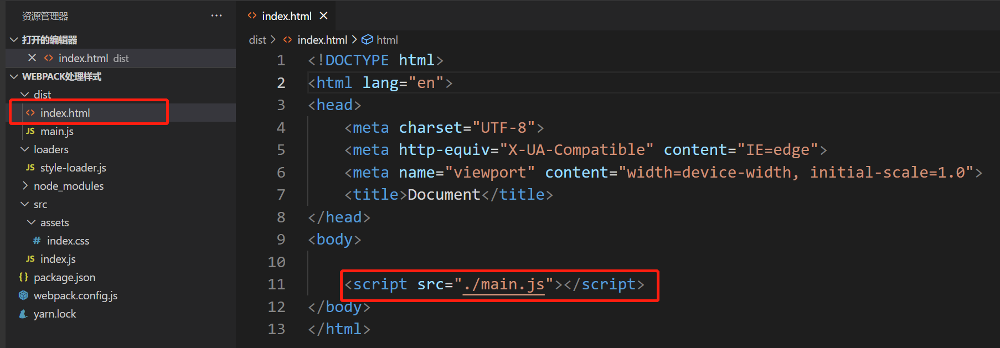
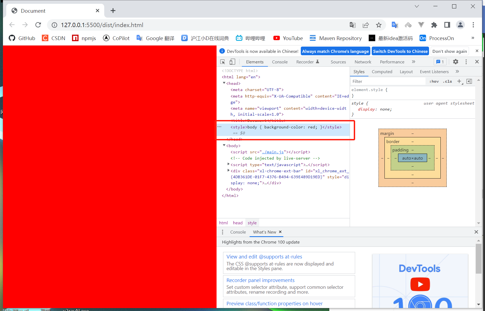

# loader 处理实例（样式处理）

在使用webpack的工程中我们有可能会见到使用require或import来引入css的代码。

事实上这种代码是无法直接执行的无论是commonjs还是es6都无法使用直接导入的css代码，它在我们的工程中可以正常使用，是因为webpack中有帮助我们做这方面处理的loader。

**style-loader编写样例：**

**打包后，创建index.js，引入打包后生成的文件main.js**

**效果：**

