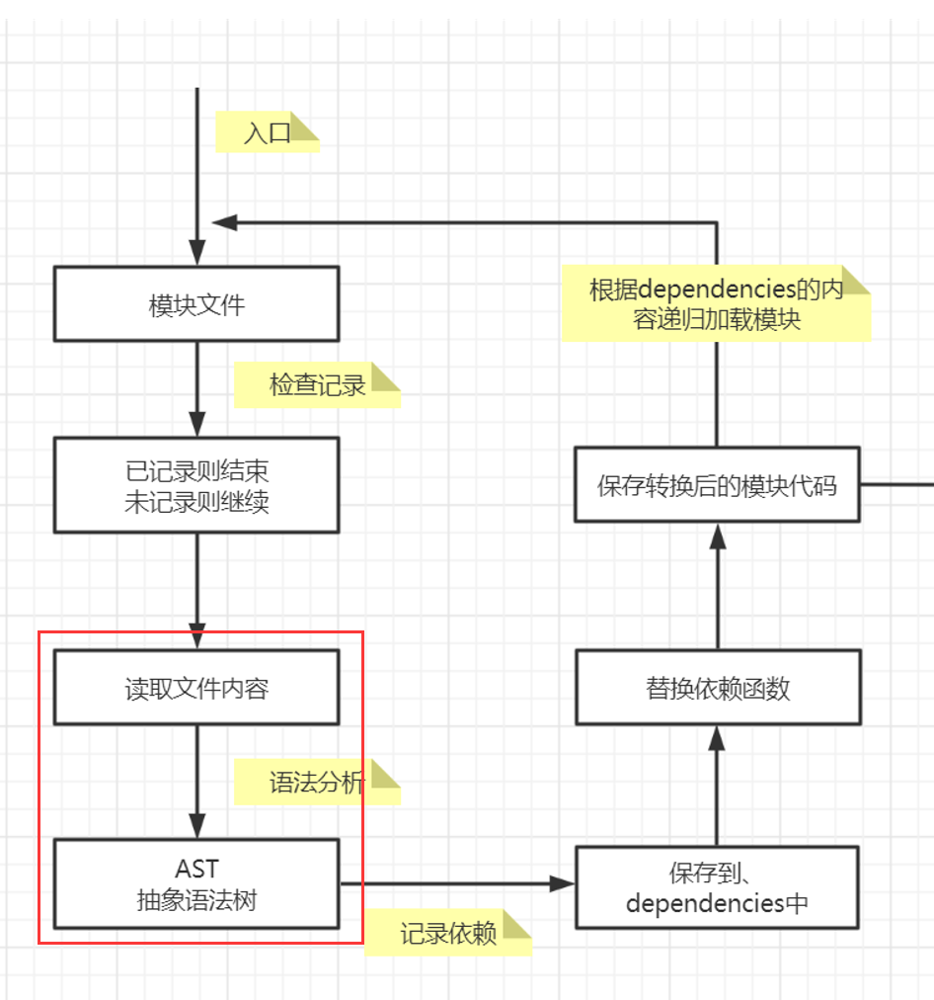
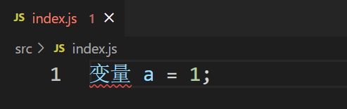
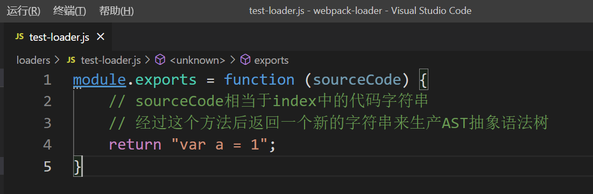
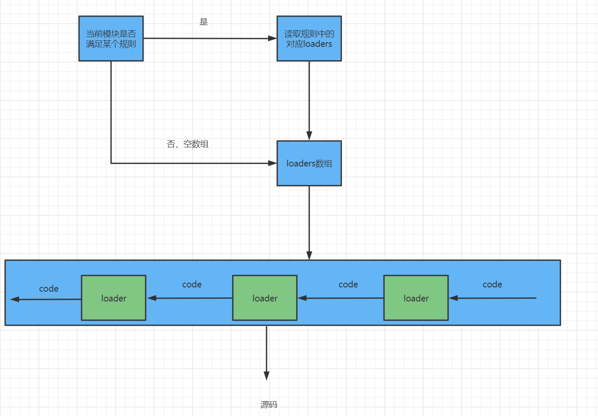
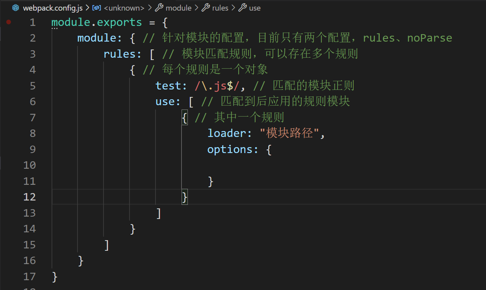

# loader
webpack做的事情，仅仅是分析出各个模块之间的依赖关系，然后形成资源列表，最终打包生成到指定文件中。
更多的功能需要借助webpack loaders和webpack plugins完成

webpack loader：loader本质上是一个函数，它的作用是将某个源码字符串转换成另一个源码字符串返回。

loader运行在【读取文件内容】和生成【ATS抽象语法树】之间

它本身只是一个我们写好的方法，传入源代码的字符串格式，返回一个用于替换源代码的字符串，用返回的值来构建【AST抽象语法树】

即【读取文件内容】到【AST抽象语法树】之间其实还有另一个工作【处理loaders】

loader处理流程：

loader配置：
完整配置

options：它是向loader文件中传入参数的参数集合，在使用这些参数时可以用【this.loaders[i].options】来获取结果。但这0显然很麻烦，因此有了另一个包【loader-utils】
