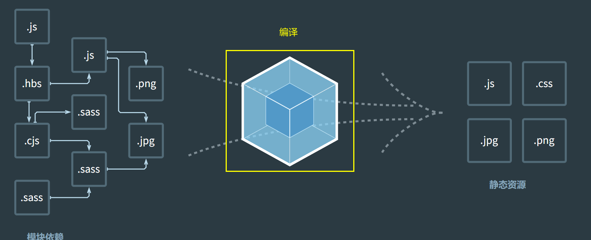
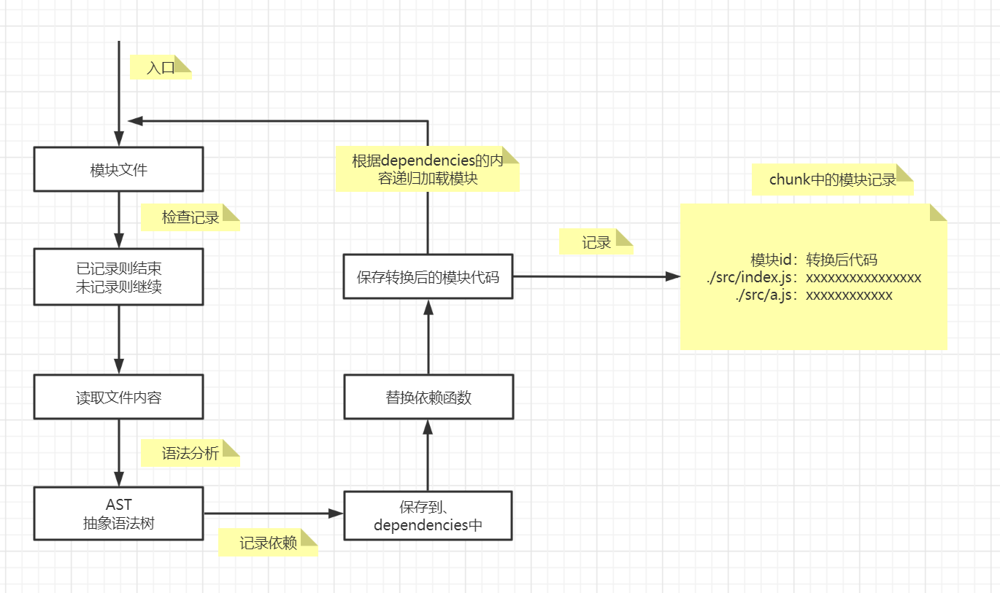

# 编译过程

webpack的作用是将源代码编译（构建、打包）成最终代码。

> 初始化 ------ 编译 ------ 输出

整个过程大致可以分为三个阶段：

- 1.初始化
- 2.编译
- 3.输出
  
## 1. 初始化

此阶段，webpack会将 **CLI 参数、配置文件、默认配置** 进行融合，形成一个最终的配置对象。

对配置的处理过程时依托第三方库 `yargs` 完成的。

此阶段相对比较简单，主要是为了接下来的编译阶段做必要处理。

目前，可以简单的理解为，初始化阶段主要是制作一个最终的配置对象。

## 2. 编译

**1）创建chunk**

chunk是webpack在内部构建过程中的一个概念，译为 **块**，它表示通过某个入口找到的所有依赖的统称。

根据入口模块（默认为 **./src/index.js**）创建一个chunk；chunk可能不止有一个，因为入口也可能不止一个。

每个chunk都至少拥有两个属性：**name、id**

- name：默认为 main
- id：位异的编号，开发环境中和name相同，生产环境中是一个数字，从0开始

**2）构建所有依赖模块**

> main chunk

**3）产生 chunk assets**

在第二部完成后，chunk会产生一个模块列表，列表中包含了 **模块id** 和 **模块转换后的代码**。

接下来，webpack会根据配置为 chunk 生成一个资源列表，即 chunk assets。

**4）合并 chunk assets**

将多个 chunk 的 assets 合并到一起，并产生一个总的 hash

## 3. 输出

此步骤非常简单，webpack将利用 node 中的 fs模块（文件处理模块），根据编译产生的总assets，生成相应的文件。

## 涉及术语

- module：模块，分割的代码单元，webpack中的模块可一世任何内容的文件，不限于 JS。
- chunk：webpack内部构建模块的块，一个chunk中包含多个模块，这些模块是入口模块通过以来分析得到的。
- bundle：chunk构建好模块后，会生成 chunk 的资源清单，每个清单中的每一项都是一个 bundle。可以认为 bundle 是最终生成的文件。
- hash：最终的资源清单所有内容联合生成的hash值
- chunkhash：chunk生成的资源清单内容联合生成的hash值
- chunkname：chunk的名称，如果没有配置则使用 main
- id：通常指chunk的唯一编号，如果在开发环境下构建，和chunkname相同；如果生产环境下构建，则使用一个从0开始的数字进行编号
